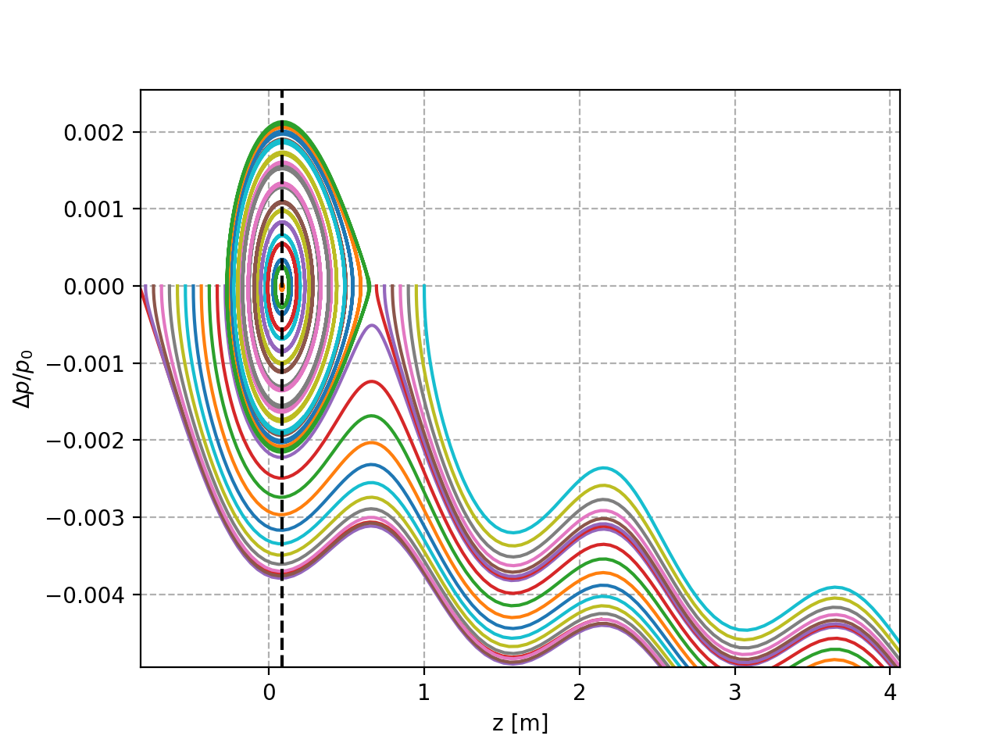

Acceleration
============

An energy ramp with an arbitrary time dependence of the beam energy can be
simulated by attaching and ``xtrack.EnergyProgram`` object to the line, as
shown in the example below.

.. literalinclude:: generated_code_snippets/energy_ramp.py
   :language: python

    Time evolution of the beam energy and the RF frequency and particles motion
    in the longitudinal phase space as obtained from the example above.