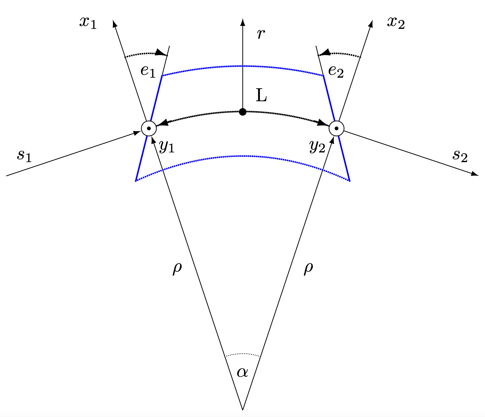
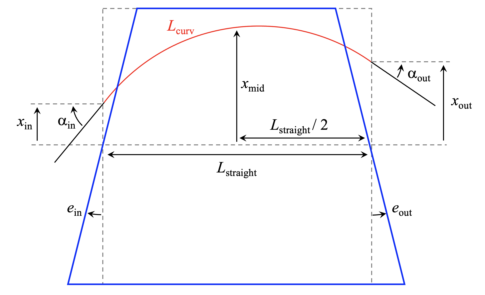
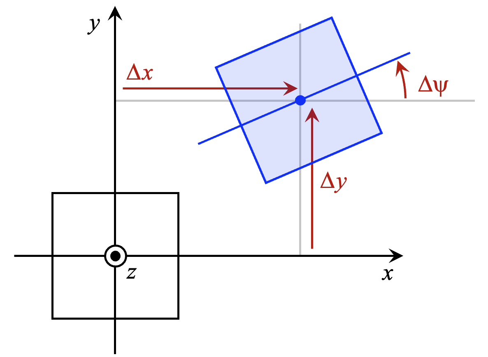
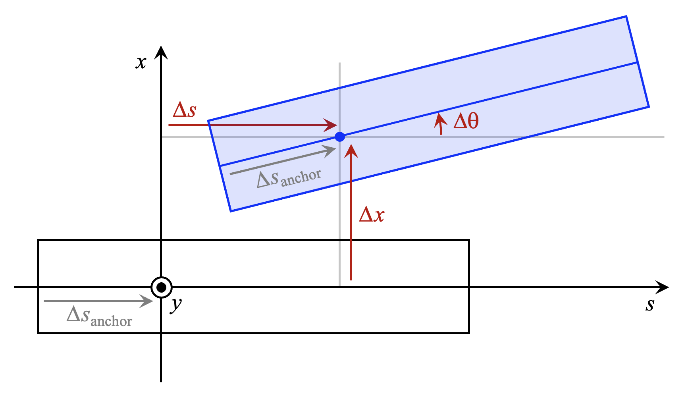

===============
Reference guide
===============

.. contents:: Table of Contents
    :depth: 3

Beam elements (xtrack)
======================

Marker
------

.. autoclass:: xtrack.Marker
    :members:
    :member-order: bysource

Drift
-----

.. autoclass:: xtrack.Drift
    :members:
    :member-order: bysource

Bend
----

.. autoclass:: xtrack.Bend
    :members:
    :member-order: bysource

The definition of the misalignment parameters (``rot_s_rad``,
``rot_s_rad_no_frame``, ``rot_x_rad``, ``rot_y_rad``, ``shift_x``, ``shift_y``, ``shift_s``)
can be found in the :ref:`element misalignment section <misalignment_label>`.

    Sector bend (figure from MAD-X manual).

.. list-table:: Naming convention
   :header-rows: 1
   :align: center

   * - Symbol
     - Xsuite attribute name
   * - :math:`L`
     - ``length``
   * - :math:`\alpha`
     - ``angle``
   * - :math:`h = 1/\rho`
     - ``angle / length``
   * - :math:`e_1`
     - ``edge_entry_angle``
   * - :math:`e_2`
     - ``edge_exit_angle``

RBend
-----

.. autoclass:: xtrack.RBend
    :members:
    :member-order: bysource

The definition of the misalignment parameters (``rot_s_rad``,
``rot_s_rad_no_frame``, ``rot_x_rad``, ``rot_y_rad``, ``shift_x``, ``shift_y``, ``shift_s``)
can be found in the :ref:`element misalignment section <misalignment_label>`.

    Rectangular with arbitrary face angles and arbitrary placement with respect to
    the reference trajectory.

.. list-table:: Naming convention
   :header-rows: 1
   :align: center

   * - Symbol
     - Xsuite attribute name
   * - :math:`L_\text{straight}`
     - ``length_straight``
   * - :math:`L_\text{curv}`
     - ``length`` (read-only, computed internally)
   * - :math:`\alpha = \alpha_\text{in} + \alpha_\text{out}`
     - ``angle``
   * - :math:`\alpha_\text{diff} = \alpha_\text{in} - \alpha_\text{out}`
     - ``rbend_angle_diff``
   * - :math:`x_\text{mid}`
     - ``rbend_shift`` (+ half of the sagitta if ``rbend_compensate_sagitta`` is ``True``)
   * - :math:`e_1`
     - ``edge_entry_angle``
   * - :math:`e_2`
     - ``edge_exit_angle``

Quadrupole
----------

.. autoclass:: xtrack.Quadrupole
    :members:
    :member-order: bysource

The definition of the misalignment parameters (``rot_s_rad``,
``rot_s_rad_no_frame``, ``rot_x_rad``, ``rot_y_rad``, ``shift_x``, ``shift_y``, ``shift_s``)
can be found in the :ref:`element misalignment section <misalignment_label>`.

Sextupole
---------

.. autoclass:: xtrack.Sextupole
    :members:
    :member-order: bysource

The definition of the misalignment parameters (``rot_s_rad``,
``rot_s_rad_no_frame``, ``rot_x_rad``, ``rot_y_rad``, ``shift_x``, ``shift_y``, ``shift_s``)
can be found in the :ref:`element misalignment section <misalignment_label>`.

Octupole
---------

.. autoclass:: xtrack.Octupole
    :members:
    :member-order: bysource

The definition of the misalignment parameters (``rot_s_rad``,
``rot_s_rad_no_frame``, ``rot_x_rad``, ``rot_y_rad``, ``shift_x``, ``shift_y``, ``shift_s``)
can be found in the :ref:`element misalignment section <misalignment_label>`.

Multipole
---------

.. autoclass:: xtrack.Multipole
    :members:
    :member-order: bysource

The definition of the misalignment parameters (``rot_s_rad``,
``rot_s_rad_no_frame``, ``rot_x_rad``, ``rot_y_rad``, ``shift_x``, ``shift_y``, ``shift_s``)
can be found in the :ref:`element misalignment section <misalignment_label>`.

UniformSolenoid
---------------

.. autoclass:: xtrack.UniformSolenoid
    :members:
    :member-order: bysource

The definition of the misalignment parameters (``rot_s_rad``,
``rot_s_rad_no_frame``, ``rot_x_rad``, ``rot_y_rad``, ``shift_x``, ``shift_y``, ``shift_s``)
can be found in the :ref:`element misalignment section <misalignment_label>`.

VariableSolenoid
----------------

.. autoclass:: xtrack.VariableSolenoid
    :members:
    :member-order: bysource

The definition of the misalignment parameters (``rot_s_rad``,
``rot_s_rad_no_frame``, ``rot_x_rad``, ``rot_y_rad``, ``shift_x``, ``shift_y``, ``shift_s``)
can be found in the :ref:`element misalignment section <misalignment_label>`.

Cavity
------

.. autoclass:: xtrack.Cavity
    :members:
    :member-order: bysource

The definition of the misalignment parameters (``rot_s_rad``,
``rot_s_rad_no_frame``, ``rot_x_rad``, ``rot_y_rad``, ``shift_x``, ``shift_y``, ``shift_s``)
can be found in the :ref:`element misalignment section <misalignment_label>`.

CrabCavity
----------

.. autoclass:: xtrack.CrabCavity
    :members:
    :member-order: bysource

The definition of the misalignment parameters (``rot_s_rad``,
``rot_s_rad_no_frame``, ``rot_x_rad``, ``rot_y_rad``, ``shift_x``, ``shift_y``, ``shift_s``)
can be found in the :ref:`element misalignment section <misalignment_label>`.

RFMultipole
-----------

.. autoclass:: xtrack.RFMultipole
    :members:
    :member-order: bysource

The definition of the misalignment parameters (``rot_s_rad``,
``rot_s_rad_no_frame``, ``rot_x_rad``, ``rot_y_rad``, ``shift_x``, ``shift_y``, ``shift_s``)
can be found in the :ref:`element misalignment section <misalignment_label>`.

ReferenceEnergyIncrease
-----------------------

.. autoclass:: xtrack.ReferenceEnergyIncrease
    :members:
    :member-order: bysource

Exciter
-------

.. autoclass:: xtrack.Exciter
    :members:
    :member-order: bysource

AC-Dipole
---------
.. autoclass:: xtrack.ACDipole
    :members:
    :member-order: bysource

Elens
-----

.. autoclass:: xtrack.Elens
    :members:
    :member-order: bysource

NonLinearLens
-------------

.. autoclass:: xtrack.NonLinearLens
    :members:
    :member-order: bysource

ElectronCooler
--------------

.. autoclass:: xtrack.ElectronCooler
    :members:
    :member-order: bysource

Wire
----

.. autoclass:: xtrack.Wire
    :members:
    :member-order: bysource

FirstOrderTaylorMap
-------------------

.. autoclass:: xtrack.FirstOrderTaylorMap
    :members:
    :member-order: bysource

SecondOrderTaylorMap
--------------------

.. autoclass:: xtrack.SecondOrderTaylorMap
    :members:
    :member-order: bysource

LineSegmentMap
--------------

.. autoclass:: xtrack.LineSegmentMap
    :members:
    :member-order: bysource

XYShift
-------

.. autoclass:: xtrack.XYShift
    :members:
    :member-order: bysource

SRotation
----------

.. autoclass:: xtrack.SRotation
    :members:
    :member-order: bysource

XRotation
---------

.. autoclass:: xtrack.XRotation
    :members:
    :member-order: bysource

YRotation
---------

.. autoclass:: xtrack.YRotation
    :members:
    :member-order: bysource

ZetaShift
---------

.. autoclass:: xtrack.ZetaShift
    :members:
    :member-order: bysource

LimitEllipse
------------

.. autoclass:: xtrack.LimitEllipse
    :members:
    :member-order: bysource

LimitRect
---------

.. autoclass:: xtrack.LimitRect
    :members:
    :member-order: bysource

LimitRectEllipse
----------------

.. autoclass:: xtrack.LimitRectEllipse
    :members:
    :member-order: bysource

LimitRacetrack
--------------

.. autoclass:: xtrack.LimitRacetrack
    :members:
    :member-order: bysource

LimitPolygon
------------

.. autoclass:: xtrack.LimitPolygon
    :members:
    :member-order: bysource

LongitudinalLimitRect
---------------------

.. autoclass:: xtrack.LongitudinalLimitRect
    :members:
    :member-order: bysource

ParticlesMonitor
----------------

.. autoclass:: xtrack.ParticlesMonitor
    :members:
    :member-order: bysource

LastTurnsMonitor
----------------

.. autoclass:: xtrack.LastTurnsMonitor
    :members:
    :member-order: bysource

BeamPositionMonitor
----------------

.. autoclass:: xtrack.BeamPositionMonitor
    :members:
    :member-order: bysource

BeamProfileMonitor
----------------

.. autoclass:: xtrack.BeamProfileMonitor
    :members:
    :member-order: bysource

BeamSizeMonitor
----------------

.. autoclass:: xtrack.BeamSizeMonitor
    :members:
    :member-order: bysource

Beam elements (xfields)
======================

Beam-beam Bi-Gaussian 2D
------------------------

.. autoclass:: xfields.BeamBeamBiGaussian2D
    :members:
    :member-order: bysource

Beam-beam Bi-Gaussian 3D
------------------------

.. autoclass:: xfields.BeamBeamBiGaussian3D
    :members:
    :member-order: bysource

Space Charge Bi-Gaussian
------------------------

.. autoclass:: xfields.SpaceChargeBiGaussian
    :members:
    :member-order: bysource

Space Charge 3D
---------------

.. autoclass:: xfields.SpaceCharge3D
    :members:
    :member-order: bysource

Intra-Beam Scattering Kicks
---------------------------

.. autoclass:: xfields.IBSAnalyticalKick
    :members:
    :member-order: bysourcef

.. autoclass:: xfields.IBSKineticKick
    :members:
    :member-order: bysource

.. _xwakes_section:

Beam elements (xwakes)
======================

See also the :ref:`Xwakes section <xwakes_user_guide_section>` in User's guide.

.. include:: wakedefs.rst

WakeResonator
-------------

.. autoclass:: xwakes.WakeResonator
    :members:
    :member-order: bysource

WakeThickResistiveWall
----------------------

.. autoclass:: xwakes.WakeThickResistiveWall
    :members:
    :member-order: bysource

WakeFromTable
-------------

.. autoclass:: xwakes.WakeFromTable
    :members:
    :member-order: bysource

Wake
----

.. autoclass:: xwakes.Wake
    :members:
    :member-order: bysource

Utilities
---------

.. autofunction:: xwakes.read_headtail_file

.. _misalignment_label:

Element misalignment
====================

Most Xsuite beam elements support misalignments. The different misalignment
parameters are defined as illustrated in the following table and figures.

See also the :ref:`misalignment section <misalignment_example_label>` in User's guide.

.. list-table:: Naming convention
   :header-rows: 1
   :align: center

   * - Symbol
     - Xsuite attribute name
   * - :math:`\Delta s_\text{anchor}`
     - ``rot_shift_anchor``
   * - :math:`\Delta \psi`
     - ``rot_s_rad`` or ``rot_s_rad_no_frame``
   * - :math:`\Delta \theta`
     - ``rot_x_rad``
   * - :math:`\Delta \phi`
     - ``rot_y_rad``
   * - :math:`\Delta x`
     - ``shift_x``
   * - :math:`\Delta y`
     - ``shift_y``
   * - :math:`\Delta s`
     - ``shift_s``

    Misalignment in the the x-y plane.

    Misalignment in the the s-x plane.

    Misalignment in the the s-y plane.

xtrack.Environment class
========================

The Xsuite environment manages variables and elements that can be shared by
different lines and can be used to create elements and line objects.

.. autoclass:: xtrack.Environment
    :members:
    :member-order: bysource

xtrack.Line class
=================

The Xsuite Line class is the main class to build beam lines. Its interface is
described in the following (more info on how to build and use beam lines for
different purposes can be found in the :doc:`Xsuite user's guide <usersguide>`).

.. autoclass:: xtrack.Line
    :members:
    :member-order: bysource

.. List of all methods
.. -------------------

.. .. autoautosummary:: xtrack.Line
..     :methods:

.. _track_method_label:

Track
=====
See also: :doc:`Single particle tracking <singlepart>`,
:doc:`Tracking with collective elements <collective>`.

.. automethod:: xtrack.Line.track

.. _twiss_method_label:

Twiss
=====

See also: :doc:`Twiss <twiss>`.

.. automethod:: xtrack.Line.twiss

Match
=====

See also: :doc:`Match<match>`.

.. automethod:: xtrack.Line.match

.. autoclass:: xdeps.Optimize
    :members:
    :member-order: bysource

.. _vary_target_label:

Vary and Target
---------------

.. autoclass:: xtrack.Vary
    :members:
    :member-order: bysource

.. autoclass:: xtrack.VaryList
    :members:
    :member-order: bysource

.. autoclass:: xtrack.Target
    :members:
    :member-order: bysource

.. autoclass:: xtrack.TargetSet
    :members:
    :member-order: bysource

.. autoclass:: xtrack.TargetRelPhaseAdvance
    :members:
    :member-order: bysource

Trajectory correction
=====================

.. autoclass:: xtrack.TrajectoryCorrection
    :members:
    :member-order: bysource

.. _build_particles_method_label:

Build particles
===============

See also: :doc:`Working with Particles objects <particlesmanip>`.

.. automethod:: xtrack.Line.build_particles

Particles class
===============

Xsuite Particles classes, including the default xtrack.Particles class, expose
the API described in the following (for more info on how to manipulate Particles
objects, see the :doc:`Particles section in the user's guide <particlesmanip>`).

.. autoclass:: xtrack.Particles
    :members:
    :inherited-members:
    :member-order: bysource

Generation of particles distributions
=====================================

See also :doc:`Particles section in the user's guide <particlesmanip>`.

Gaussian bunch generation (6D)
------------------------------

.. autofunction:: xpart.generate_matched_gaussian_bunch

Longitudinal coordinates generation
-----------------------------------

.. autofunction:: xpart.generate_longitudinal_coordinates

Normalized transverse coordinates generation
--------------------------------------------

Gaussian
~~~~~~~~

.. autofunction:: xpart.generate_2D_gaussian

Polar grid
~~~~~~~~~~

.. autofunction:: xpart.generate_2D_polar_grid

Uniform circular sector
~~~~~~~~~~~~~~~~~~~~~~~

.. autofunction:: xpart.generate_2D_uniform_circular_sector

Pencil
~~~~~~

.. autofunction:: xpart.generate_2D_pencil

.. autofunction:: xpart.generate_2D_pencil_with_absolute_cut

CPU and GPU contexts
====================

See also :doc:`Getting Started Guide <singlepart>`

Xsuite supports different plaforms allowing the exploitation of different kinds of hardware (CPUs and GPUs).
A context is initialized by instanciating objects from one of the context classes available Xobjects, which is then passed to the other Xsuite components (see example in :doc:`Getting Started Guide <gettingstarted>`).
Contexts are interchangeable as they expose the same API.
Custom kernel functions can be added to the contexts. General source code with annotations can be provided to define the kernels, which is then automatically specialized for the chosen platform (see :doc:`dedicated section <autogeneration>`).

Three contexts are presently available:

 - The :ref:`Cupy context<cupy_context>`, based on `cupy`_-`cuda`_ to run on NVidia GPUs
 - The :ref:`Pyopencl context<pyopencl_context>`, bases on `PyOpenCL`_, to run on CPUs or GPUs throught PyOPENCL library.
 - The :ref:`CPU context<cpu_context>`, to use conventional CPUs

The corresponfig API is described in the following subsections.

.. _cupy: https://cupy.dev
.. _cuda: https://developer.nvidia.com/cuda-zone
.. _PyOpenCL: https://documen.tician.de/pyopencl/

.. _cupy_context:

Cupy context
-------------

.. autoclass:: xobjects.ContextCupy
    :members:
    :member-order: bysource
    :inherited-members:

.. _pyopencl_context:

PyOpenCL context
----------------
.. autoclass:: xobjects.ContextPyopencl
    :members:
    :member-order: bysource
    :inherited-members:

.. _cpu_context:

CPU context
-----------

.. autoclass:: xobjects.ContextCpu
    :members:
    :member-order: bysource
    :inherited-members:

Configuration tools
===================

xtrack.Multisetter class
------------------------

See also: :doc:`Fast lattice changes<fast_lattice_changes>`

.. autoclass:: xtrack.MultiSetter
    :members:
    :member-order: bysource

Space charge configuration
--------------------------

See also: :doc:`Space charge <spacechargeauto>`

.. autofunction:: xfields.install_spacecharge_frozen

.. autofunction:: xfields.replace_spacecharge_with_quasi_frozen

.. autofunction:: xfields.replace_spacecharge_with_PIC

Loss location refinement
------------------------

See also: :doc:`Loss location refinement <collimation>`

.. autoclass:: xtrack.LossLocationRefinement
    :members:
    :member-order: bysource

