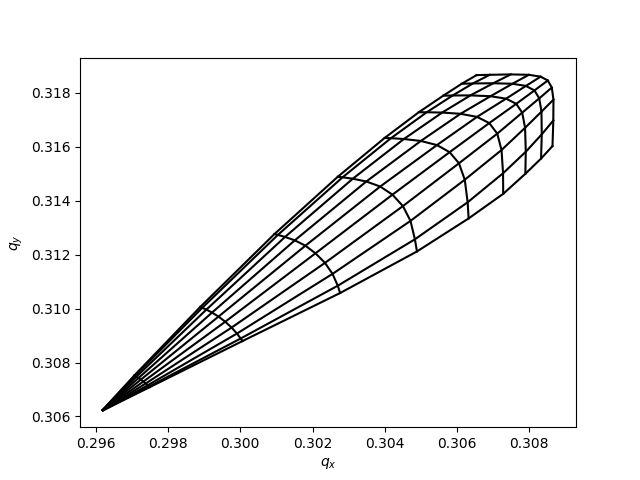
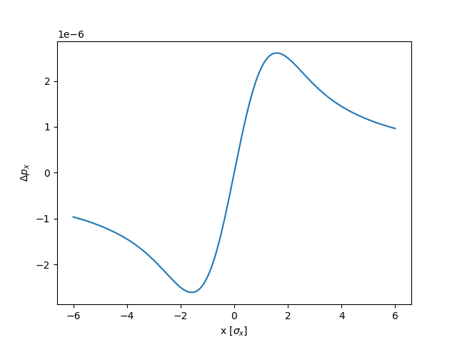
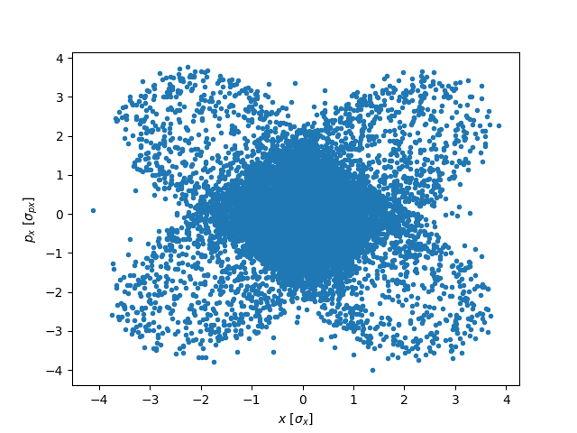
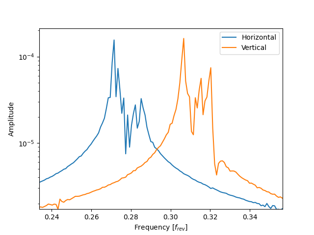

Beam-beam
=========

Weak-strong 2D
--------------

The example below shows how to introduce a 2D beam-beam element in a line and perform few studies based on tracking. The 2D beam-beam element provides a kick based on the Basseti-Erskine formula neglecting any longitudinal varitations of the beam-beam force.

.. literalinclude:: generated_code_snippets/beambeamws.py
   :language: python

Weak-strong 3D
--------------

The 3D beam-beam element can be used similarly, replacing the instanciation of the beam-beam element as in the example below. This element takes into account longitudinal variations of the beam-beam force (hourglass, crossing angle) based on a longitudinal slicing of the beam (Hirata's method) handled by the :class:`xfields.beam_elements.TempSlicer`.

.. code-block:: python

   # Number of longitudinal slices
   n_slices = 21
   # Slicer used to determine the position and charge of the slices
   # based on an optimised algorithm by D. Shatilov. (other options are also possible)
   slicer = xf.TempSlicer(n_slices=n_slices, sigma_z=sigma_z, mode="shatilov")
   bbeam = xf.BeamBeamBiGaussian3D(
               _context=context,
               other_beam_q0 = particles.q0,
               # Full crossing angle at the IP in rad
               phi = 500.0E-2,
               # Roll angle of the crossing angle in rad (0 -> horizontal, pi/2 -> vertical)
               alpha = 0.0,
               # charge in each slice
               slices_other_beam_num_particles = slicer.bin_weights * bunch_intensity,
               # longitudinal position of the slice
               slices_other_beam_zeta_center = slicer.bin_centers,
               # transverse sizes of the slices at the IP (squarred)
               slices_other_beam_Sigma_11 = np.zeros(n_slices,dtype=float)+physemit_x*beta_x,
               slices_other_beam_Sigma_12 = np.zeros(n_slices,dtype=float),
               slices_other_beam_Sigma_13 = np.zeros(n_slices,dtype=float),
               slices_other_beam_Sigma_14 = np.zeros(n_slices,dtype=float),
               slices_other_beam_Sigma_22 = np.zeros(n_slices,dtype=float)+physemit_x/beta_x,
               slices_other_beam_Sigma_23 = np.zeros(n_slices,dtype=float),
               slices_other_beam_Sigma_24 = np.zeros(n_slices,dtype=float),
               slices_other_beam_Sigma_33 = np.zeros(n_slices,dtype=float)+physemit_y*beta_y,
               slices_other_beam_Sigma_34 = np.zeros(n_slices,dtype=float),
               slices_other_beam_Sigma_44 = np.zeros(n_slices,dtype=float)+physemit_y/beta_y)

Strong-strong (soft-Gaussian)
-----------------------------

Strong-strong simulations can be performed using the :doc:`pipeline`, as in the example below.

.. literalinclude:: generated_code_snippets/pipeline.py
   :language: python

In collisions featuring a low disruption (i.e. the beam moments do not vary significantly during the interaction), the quasi-strong-strong (aka frozen-strong-strong) model may be enabled by setting the argument 'quasistrongstrong
= True' in :class:`xfields.beam_elements.ConfigForUpdate*`. In this configuration, the beam moments are computed once at the start of the collison and kept constant throught the collison, thus reducing the computing load. The argument 'update_every' allows to further reduce the computing load by keeping the moments for the given amount of turns. This model is suitable for effects that build up over may turns. (more details in https://accelconf.web.cern.ch/eefact2022/papers/wezat0102.pdf)

For a 2D beam-beam interactions, the beam-beam element and the :class:`xfields.beam_elements.ConfigForUpdate*` have to be redifined as in the example below.

.. code-block:: python

   config_for_update_b1_IP1=xf.ConfigForUpdateBeamBeamBiGaussian2D(
      pipeline_manager=pipeline_manager,
      element_name='IP1',
      partner_particles_name = 'B2b1',
      update_every=1
      )
   config_for_update_b2_IP1=xf.ConfigForUpdateBeamBeamBiGaussian2D(
      pipeline_manager=pipeline_manager,
      element_name='IP1',
      partner_particles_name = 'B1b1',
      update_every=1
      )
   bbeamIP1_b1 = xf.BeamBeamBiGaussian2D(
               _context=context,
               other_beam_q0 = particles_b2.q0,
               other_beam_beta0 = particles_b2.beta0[0],
               config_for_update = config_for_update_b1_IP1)
   bbeamIP1_b2 = xf.BeamBeamBiGaussian2D(
               _context=context,
               other_beam_q0 = particles_b1.q0,
               other_beam_beta0 = particles_b1.beta0[0],
               config_for_update = config_for_update_b2_IP1)

Poisson Solver
--------------

Particle-in-cell simulations using a Poisson solver for the beam-beam interaction is currently not implemented in xfields

Beam-beam in a real lattice
---------------------------

Identically to the examples above, beam-beam elements can be introduced into the lattice of a full machine. Several tools exist to ease the setup of beam-beam interactions in a collider lattice: :doc:`xmask`
