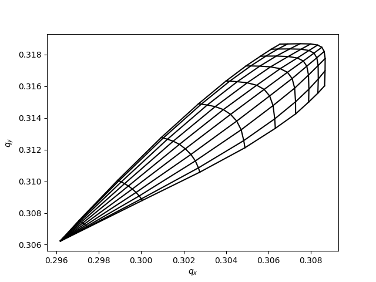
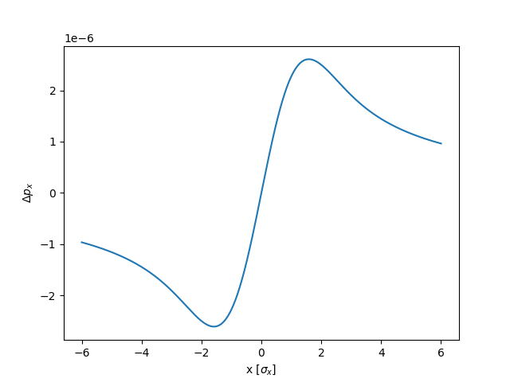
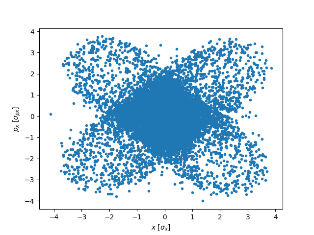
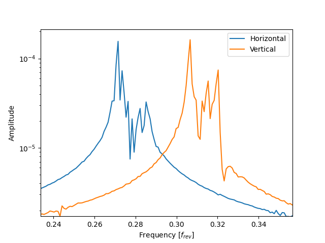

Beam-beam
=========

Xfields provides three complementary beam-beam workflows:

* In the **weak-strong** model, tracked particles receive the field of a
  prescribed opposing bunch. The opposing distribution does not react to the
  tracked bunch.
* In the **strong-strong** model, both bunches evolve during the collision.
  Xfields provides both a soft-Gaussian model and a particle-in-cell (PIC)
  model.
* In the **rigid-bunch** model, every bunch in both beams is represented by a
  coherent centroid. This is the model intended for self-consistent
  bunch-to-bunch orbit and tune studies with realistic filling patterns.

The weak-strong and strong-strong examples below describe the interaction of
one bunch from each beam. A complete collider can contain many such
interactions. The rigid-bunch workflow instead treats the filled bunch trains
as part of the model itself.

Weak-strong
-----------

The analytical weak-strong elements model the opposing bunch as a
bi-Gaussian charge distribution. Since its moments are fixed, only the
particles in the tracked (weak) bunch are updated.

2D element
~~~~~~~~~~

:class:`xfields.BeamBeamBiGaussian2D` applies the Bassetti-Erskine transverse
kick. It neglects longitudinal variation of the beam-beam force and is
therefore useful for long-range encounters and simplified head-on studies.
The following example constructs the element, plots its force, computes a
footprint and tracks through a simple lattice.

.. literalinclude:: generated_code_snippets/beambeamws.py
   :language: python

3D element
~~~~~~~~~~

:class:`xfields.BeamBeamBiGaussian3D` includes the longitudinal variation of
the interaction, including hourglass and crossing-angle effects. The opposing
bunch is divided into longitudinal slices, commonly generated with
:class:`xfields.TempSlicer`. The element receives the population, longitudinal
position and transverse covariance matrix of every slice. For example:

.. code-block:: python

   slicer = xf.TempSlicer(
       n_slices=21, sigma_z=sigma_z, mode='shatilov')

   beambeam = xf.BeamBeamBiGaussian3D(
       other_beam_q0=particles.q0,
       phi=250e-6,       # half crossing angle [rad]
       alpha=0,          # crossing plane [rad]
       slices_other_beam_num_particles=
           slicer.bin_weights * bunch_intensity,
       slices_other_beam_zeta_center=slicer.bin_centers,
       slices_other_beam_Sigma_11=np.full(21, sigma_x**2),
       slices_other_beam_Sigma_12=np.zeros(21),
       slices_other_beam_Sigma_22=np.full(21, sigma_px**2),
       slices_other_beam_Sigma_33=np.full(21, sigma_y**2),
       slices_other_beam_Sigma_34=np.zeros(21),
       slices_other_beam_Sigma_44=np.full(21, sigma_py**2),
   )

Configuring a collider
~~~~~~~~~~~~~~~~~~~~~~

For a two-line collider, the environment beam-beam configuration tools place
all head-on and long-range interactions consistently in the two reference
frames. First install the inactive elements, then build the trackers and
configure the strong-beam intensity and emittances:

.. code-block:: python

   env.xfields.install_beambeam_interactions(
       clockwise_line='lhcb1',
       anticlockwise_line='lhcb2',
       ip_names=['ip1', 'ip2', 'ip5', 'ip8'],
       delay_at_ips_slots=[0, 891, 0, 2670],
       num_long_range_encounters_per_side=25,
       num_slices_head_on=11,
       harmonic_number=35640,
       bunch_spacing_buckets=10,
       sigmaz=0.075,
       mode='particles',
   )

   env.build_trackers()

   env.xfields.configure_beambeam_interactions(
       num_particles=1.15e11,
       nemitt_x=2.5e-6,
       nemitt_y=2.5e-6,
   )

By default all installed interactions are active. To track a bunch in a
realistic filling, select the bunch and mask encounters with
:meth:`xfields.XfieldsEnvironmentAPI.apply_filling_pattern`:

.. code-block:: python

   env.xfields.apply_filling_pattern(
       filling_pattern_cw=filling_pattern_cw,
       filling_pattern_acw=filling_pattern_acw,
       i_bunch_cw=0,
       i_bunch_acw=0,
   )

The installation, configuration and filling operations are documented in the
:ref:`beam-beam configuration API reference
<beambeam-configuration-api-reference>`.

Strong-strong
-------------

Strong-strong simulations track both colliding bunches and exchange their
state through the :doc:`pipeline`. Each beam is represented by a separate
line and particle set, and the lines are advanced together by an
:class:`xtrack.PipelineMultiTracker`.

Soft-Gaussian model
~~~~~~~~~~~~~~~~~~~

The soft-Gaussian model represents both bunches with macroparticles, but uses
the measured slice centroids and covariance matrices to compute analytical
bi-Gaussian kicks. A :class:`xfields.ConfigForUpdateBeamBeamBiGaussian3D`
connects each beam-beam element to its opposing bunch and controls how often
the moments are updated.

.. literalinclude:: generated_code_snippets/beambeam_strongstrong.py
   :language: python

For collisions with low disruption, ``quasistrongstrong=True`` freezes the
opposing-beam moments after their first computation. ``update_every`` can keep
the same moments for several turns. These options reduce the cost when the
beam distribution changes slowly. The corresponding 2D workflow uses
:class:`xfields.ConfigForUpdateBeamBeamBiGaussian2D` together with
:class:`xfields.BeamBeamBiGaussian2D`.

Particle-in-cell model
~~~~~~~~~~~~~~~~~~~~~~

:class:`xfields.BeamBeamPIC3D` provides a fully self-consistent 3D
particle-in-cell model. At each collision step, the macroparticle charge is
deposited on a mesh, the Poisson equation is solved, and the resulting field
is applied to the opposing bunch. The two PIC elements exchange their bunch
state through the same pipeline mechanism used by the soft-Gaussian model.

The following CPU example builds a PIC element for each beam, connects the
two elements through a pipeline, tracks one collision, and compares the kicks
against the analytical 3D model.

.. literalinclude:: generated_code_snippets/beambeam_pic.py
   :language: python

Rigid-bunch
-----------

The rigid-bunch mode computes the coherent, self-consistent closed orbit and
linear optics of every filled bunch in two counter-rotating beams. Each bunch
is represented by a single transverse bi-Gaussian distribution: its centroid
moves coherently, while its internal particle distribution is not tracked.
This makes the mode suitable for studying bunch-to-bunch orbit and tune
variations produced by a collider's filling pattern.

The beam-beam interactions are installed on the two lines with
``mode='rigid_bunch'``. Configuring them returns a
:class:`xfields.BeamBeamRigidBunchStudy`, which stores the filling patterns and
provides :meth:`~xfields.BeamBeamRigidBunchStudy.solve` for the self-consistent
two-beam solution. The result contains separate ``cw`` and ``acw`` per-bunch
tables; individual bunches can be selected by filling slot, and their ordinary
:class:`xtrack.TwissTable` can be inspected with the standard table API. See
the :ref:`beam-beam configuration API reference
<beambeam-configuration-api-reference>` for all available operations.

**Full-lattice example.** The following example runs this workflow on the
full, thick LHC lattice. It uses a prepared subset of an operational filling
pattern to keep the runtime manageable, then illustrates how to inspect tunes,
closed orbits and per-element results.

.. literalinclude:: generated_code_snippets/lhc_rigid_bunch.py
   :language: python

**Reduced-model example.** For faster calculations, the lattice regions
between consecutive beam-beam encounters can be replaced by second-order
maps, while the beam-beam elements remain exact. The reduced study is a new
object, leaving the full-lattice study untouched. After solving the reduced
problem, :meth:`~xfields.BeamBeamRigidBunchStudy.load_solution` transfers its
beam-beam state back to the full lattice. The following example mirrors the
full-lattice workflow above and highlights these additional steps.

.. literalinclude:: generated_code_snippets/lhc_rigid_bunch_reduced_model.py
   :language: python
