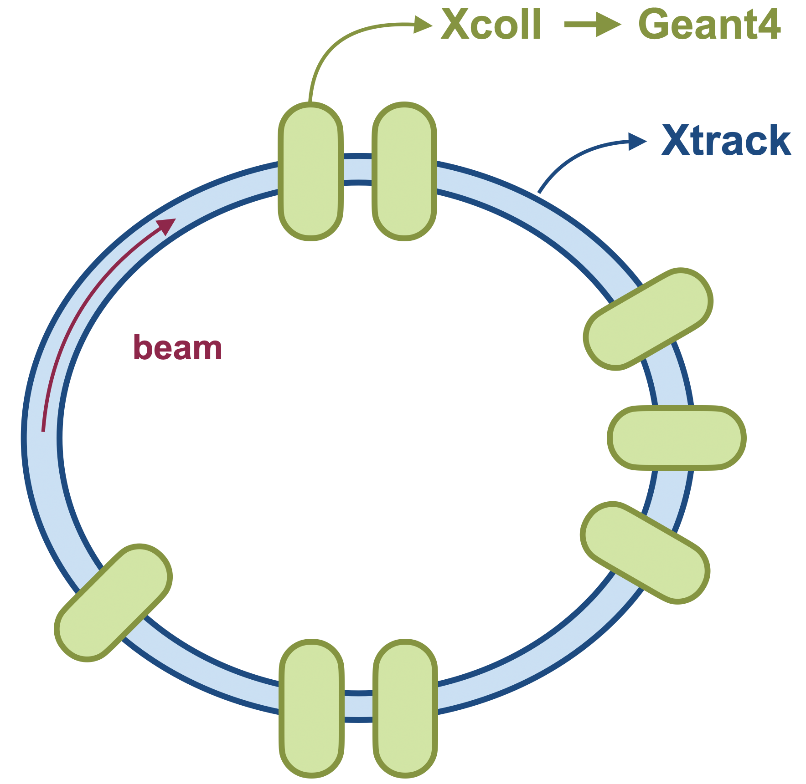

============================================
Particle-matter interaction and collimation
============================================

.. contents:: Table of Contents
    :depth: 3

Introduction
============
In Xsuite, collimation is added to the simulations by the Xcoll package. 
The collimators themselves are created as instances of :class:`xcoll.EverestCollimator`, :class:`xcoll.EverestCrystal` and :class:`xcoll.BlackAbsorber`. In addition, we also have :class:`xcoll.EverestBlock`. The Xcoll package also describes the interaction between the particles and the collimators in the simulation. 

Loss maps are created after the simulations to assess the performance of the LHC collimation system. They give information about where the beam losses are located in the LHC. The loss map, after one simulation, is created as an instance of :class:`xcoll.LossMap`. 

Collimator objects
==================

BaseCollimator
--------------
Since :class:`xcoll.EverestCollimator`, :class:`xcoll.EverestCrystal` and :class:`xcoll.BlackAbsorber` describes different kinds of collimators they all inherit from the abstract class :class:`BaseCollimator` which contains all the basic attributes of a collimator. Some of these attributes, or fields, are made accessible to the C tracking code as seen in the code block below. 

.. code-block:: python

   class BaseCollimator(xt.BeamElement):
       _xofields = {
           'inactive_front': xo.Float64,  # Drift before jaws
           'active_length':  xo.Float64,  # Length of jaws
           'inactive_back':  xo.Float64,  # Drift after jaws
           'jaw_L':          xo.Float64,  # left jaw (distance to ref)
           'jaw_R':          xo.Float64,  # right jaw
           'ref_x':          xo.Float64,  # center of collimator reference frame
           'ref_y':          xo.Float64,
           'sin_zL':         xo.Float64,  # angle of left jaw
           'cos_zL':         xo.Float64,
           'sin_zR':         xo.Float64,  # angle of right jaw
           'cos_zR':         xo.Float64,
           'sin_yL':         xo.Float64,  # tilt of left jaw (around jaw midpoint)
           'cos_yL':         xo.Float64,
           'tan_yL':         xo.Float64,
           'sin_yR':         xo.Float64,  # tilt of right jaw (around jaw midpoint)
           'cos_yR':         xo.Float64,
           'tan_yR':         xo.Float64,
           '_side':          xo.Int8,     # is it a onesided collimator?
           'active':         xo.Int8
       }

However, to make things more user-friendly the :class:`BaseCollimator` has more properties defined in the class itself. These properties uses the fields from the code block above to define properties such as :meth:`jaw_LU`, :meth:`angle` and :meth:`tilt`. 

The collimator jaws are separated into the left and the right jaw, as seen defined in the code block above as well. In the figure below, you can see how 'jaw_L' and 'jaw_R' are defined. However, sometimes it is necessary to know, or change, the position of the corners of the collimator. The first pair of corners are called :meth:`jaw_LU` and :meth:`jaw_RU`, where the 'U' stands for upstream. The two remaining corners are defined as :meth:`jaw_LD` and :meth:`jaw_RD`, where the 'D' stands for downstream. Note that when setting the value of e.g. :meth:`jaw_RU` then :meth:`jaw_RD` is kept fixed while both 'jaw_R' and the tilt changes. 

.. code-block:: python

   collimatorObject.jaw
   collimatorObject.jaw_LU
   collimatorObject.jaw_RU
   collimatorObject.jaw_RD
   collimatorObject.jaw_RU

.. figure:: figures/collimator_jaws_top_view.png
    :width: 75%
    :align: center

.. figure:: figures/collimator_jaws_front_view.png
    :width: 75%
    :align: center

In addition, it is convenient to have the angle and the tilt of the jaws. The angle is the angle of the tilt of the jaws in the xy-plane while the tilt is the angle of the tilt of the jaws in the x'z-plane. For clarity, the angle is shown as alpha, and the tilt as theta in the images. Note that the tilt is in radians while the angle is in degrees.

.. code-block:: python

   collimatorObject.angle
   collimatorObject.angle_L
   collimatorObject.angle_R
   collimatorObject.tilt
   collimatorObject.tilt_L
   collimatorObject.tilt_R

Furthermore, it is also possible to get (and set) the length and the side of the collimator. 

.. code-block:: python

   collimatorObject.side
   collimatorObject.length

EverestCollimator
^^^^^^^^^^^^^^^^^
The :class:`EverestCollimator` contains all the same fields as :class:`BaseCollimator`, but in addition it also has these:

.. code-block:: python

   class EverestCollimator(BaseCollimator):
    _xofields = { **BaseCollimator._xofields,
        '_material':        Material,
        'rutherford_rng':   xt.RandomRutherford,
        '_tracking':        xo.Int8
    }

The new field of interest for the user is the material of the collimator. This is accessed by the method :meth:`EverestCollimator.material`. The material itself is an instance of :class:`xcoll.materials.Material`.

EverestCrystal
^^^^^^^^^^^^^^
:class:`EverestCrystal` has the same fields as :class:`BaseCollimator`, but in addition it has some extra fields which are needed to describe the crystal collimator. Note also that the material used for the crystal collimator is not the same as for :class:`xcoll.EverestCollimator`, but an instance of :class:`xcoll.materials.CrystalMaterial`.

.. code-block:: python

   class EverestCrystal(BaseCollimator):
       _xofields = { **BaseCollimator._xofields,
           'align_angle':        xo.Float64,  #  = - sqrt(eps/beta)*alpha*nsigma
           '_bending_radius':    xo.Float64,
           '_bending_angle':     xo.Float64,
           '_critical_angle':    xo.Float64,
           'xdim':               xo.Float64,
           'ydim':               xo.Float64,
           'thick':              xo.Float64,
           'miscut':             xo.Float64,
           '_orient':            xo.Int8,
           '_material':          CrystalMaterial,
           'rutherford_rng':     xt.RandomRutherford,
           '_tracking':          xo.Int8
       }

These new fields are accessed through the methods:

.. code-block:: python

   EverestCrystal.critical_angle
   EverestCrystal.bending_radius
   EverestCrystal.bending_angle
   EverestCrystal.material
   EverestCrystal.lattice

BlackAbsorber
^^^^^^^^^^^^^
:class:`xcoll.BlackAbsorber` is different from :class:`xcoll.EverestCollimator` and :class:`EverestCrystal`. The absorber has only one extra field compared to the :class:`xcoll.BaseCollimator`: 

.. code-block:: python

   class BlackAbsorber(BaseCollimator):
       _xofields = { **BaseCollimator._xofields,
           '_tracking':        xo.Int8
       }

BaseBlock and EverestBlock
==========================
:class:`xcoll.EverestBlock`, which inherit :class:`xcoll.BaseBlock`, describes a block with an infinite transversal length. This class has the fields:

.. code-block:: python

   class EverestBlock(BaseBlock):
    _xofields = { **BaseBlock._xofields,
        '_material':        Material,
        'rutherford_rng':   xt.RandomRutherford,
        '_tracking':        xo.Int8,
        '_only_mcs':        xo.Int8
    }

Furthermore, :class:`xcoll.EverestBlock` needs a material, which is an instance of :class:`xcoll.materials.Material`, and that can be accessed through 

.. code-block:: python

   EverestBlock.material

Creating a Collimator or Block object
=====================================
A collimator (or block) object can be created in two different ways; either directly with the class or by loading from file. 
For example:

.. code-block:: python

	import xcoll as xc
	
	block = xc.EverestBlock(length=1., material=xc.materials.Tungsten)
	collimator = xc.EverestCollimator(length=1., material=xc.materials.Tungsten)
	collimator_crystal = xc.EverestCrystal(length=1., material=xc.materials.SiliconCrystal)
	black_absorber = xc.BlackAbsorber(length=1., material=xc.materials.Graphite)

Or, by using the CollimationManager to load from file:

.. code-block:: python

   path_in  = xc._pkg_root.parent / 'examples'
   coll_manager = xc.CollimatorManager.from_yaml(path_in / 'colldb' / f'lhc_run3.yaml',
                                              line=line, beam=beam, _context=context)

   # Install collimators in line as black absorbers 
   coll_manager.install_everest_collimators(verbose=True)

Generating particles on a collimator
====================================
For some collimation studies it is convenient to generate a initial pencil distribution on a collimator. Xcoll has its own function for this :meth:`xcoll.generate_pencil_on_collimator`. An example is shown below.

.. code-block:: python

	import xcoll as xc 
	import xpart as xp
        import xtrack as xt
	import numpy as np
	import json
	
	beam =  1
	plane = 'H'
	num_turns     = 200
	num_particles = 10000
	path_in  = xc._pkg_root.parent / 'examples'

	# Load from json
	with open(os.devnull, 'w') as fid:
    	   with contextlib.redirect_stdout(fid):
        	line = xt.Line.from_json(path_in / 'machines' / f'lhc_run3_b{beam}.json')
        
        # Initialise collmanager
	coll_manager = xc.CollimatorManager.from_yaml(path_in / 'colldb' / f'lhc_run3.yaml',
                                              line=line, beam=beam, _context=context)
	# Install collimators into line	
	coll_manager.install_everest_collimators(verbose=True)
	
	# Aperture model check
	print('\nAperture model check after introducing collimators:')
	with open(os.devnull, 'w') as fid:
    	    with contextlib.redirect_stdout(fid):
         	df_with_coll = line.check_aperture()
	assert not np.any(df_with_coll.has_aperture_problem)
	

	# Build the tracker
	coll_manager.build_tracker()
	# Set openings
	coll_manager.set_openings()
	
	tcp  = f"tcp.{'c' if plane=='H' else 'd'}6{'l' if int(beam)==1 else 'r'}7.b{beam}"
	emittance = coll_manager.colldb.emittance
	beta_gamma_rel = coll_manager.colldb._beta_gamma_rel
	part = xc.generate_pencil_on_collimator(line=line, emittance=emittance, beta_gamma_rel=bet, 
                                              collimator_name=tcp, num_particles=num_particles)
	
Lossmaps
========
Lossmaps are created as instances of :class:`xcoll.LossMap`. The lossmap itself and its summary are calculated when the object is created. It is also possible to save both the lossmap and summary to file with :meth:`xcoll.LossMap.to_json` and :meth:`xcoll.LossMap.save_summary`. For example: 

.. literalinclude:: generated_code_snippets/lhc_run3_lossmap.py
   :language: python

Loss location refinement
========================

In Xtrack simulations particles are lost at defined aperture elements (e.g.
:class:`xtrack.LimitRect`, :class:`xtrack.LimitEllipse`, :class:`xtrack.LimitRectEllipse`,
:class:`xtrack.LimitPolygon`). A more accurate estimate of the loss locations can be
obtained after the tracking is finished using the
:class:`xtrack.LossLocationRefinement` tool . The tool builds
an interpolated aperture model between the aperture elements and backtracks the
particles in order to identify the impact point. The following example illustrates
how to use this feature.

See also: :class:`xtrack.LossLocationRefinement`

.. literalinclude:: generated_code_snippets/loss_location_refinement.py
   :language: python

.. figure:: figures/loss_location_refinement.png
    :width: 85%
    :align: center

    Generated transition between the defined apertures. Red dots represent the
    location of the particle-loss events. `See the code generating the image.
    <https://github.com/xsuite/xtrack/blob/main/examples/collimation/
    001_loss_location_refinement.py>`_

Material definitions
====================

Materials database
------------------
Xcoll ships with a built-in database of materials (which cannot be modified at runtime):

.. code-block:: python

    import xcoll as xc
    xc.materials.show(full=True)

Materials can be accessed from the module by their full name only:

.. code-block:: python

    print(xc.materials.Aluminium)

or from the database using their name or aliases:

.. code-block:: python

    mat1 = xc.materials.db['Aluminium']
    mat2 = xc.materials.db['Aluminum']
    mat3 = xc.materials.db['Al']
    print(mat1)
    print(mat2)
    print(mat3)
    print(mat1 == mat2)
    print(mat1 == mat3)

When a material is known to FLUKA or Geant4, it has a ``fluka_name`` resp ``geant4_name`` attribute:

.. code-block:: python

    print(f"Copper-Diamond in FLUKA is called: {xc.materials.CopperDiamond.fluka_name}")
    print(f"Aluminium in Geant4 is called: {mat1.geant4_name}")

Defining New Materials
----------------------
All elements in the periodic table are predefined in the database.
When defining a new elemental material (i.e. an allotrope), the fields
``'Z'``, ``'A'``, and ``'density'`` are required:

.. code-block:: python
    WhitePhosphorus = xc.Material(Z=15, A=123.895/4, density=1.823, name='WhitePhosphorus',
                                  state='solid', info="P4, but defined as element instead of compound.")

It is not possible to redefine existing elements in the database, but it
is possible to adapt them with the `adapt` method.

.. code-block:: python

    Ozone = xc.materials.Oxygen.adapt(density=2.144e-3, name='Ozone',
                                      info="O3, but defined as element instead of compound.")

When adapting a material, unspecified fields are taken from the original material,
like the state, and temperature and pressure at which the density applies:

.. code-block:: python

    print(xc.materials.Oxygen)
    print(Ozone)
    print(xc.materials.Oxygen.to_dict())
    print(Ozone.to_dict())
    # But names and info are not copied:
    print(f"Original name: {xc.materials.Oxygen.name}, adapted name: {Ozone.name}")
    print(f"Original short name: {xc.materials.Oxygen.short_name}, adapted short name: {Ozone.short_name}")
    print(f"Original FLUKA name: {xc.materials.Oxygen.fluka_name}, adapted FLUKA name: {Ozone.fluka_name}")
    print(f"Original Geant4 name: {xc.materials.Oxygen.geant4_name}, adapted Geant4 name: {Ozone.geant4_name}")
    print(f"Original info: `{xc.materials.Oxygen.info}`")
    print(f"Adapted info: `{Ozone.info}`")

Defining New Compounds and Mixtures
-----------------------------------
Compounds are defined by specifying their components as a chemical formula,
and hence the fields ``components`` and ``n_atoms``:

.. code-block:: python

    Ethanol = xc.Material(components=['C', 'H', 'O'], n_atoms=[2, 6, 1], density=0.78945, name='Ethanol',
                          state='liquid', temperature=293.15)
    print(Ethanol)
    print(Ethanol.composition)
    # Any doubled components are automatically combined:
    EthanolBis = xc.Material(components=['C', 'H', 'C', 'H', 'O', 'H'], n_atoms=[1, 3, 1, 2, 1, 1], density=0.78945,
                    name='EthanolBis', state='liquid', temperature=293.15)
    print(f"{Ethanol == EthanolBis=}")

Mixtures are not a chemical formula, but a physical mixture of different materials.
They are defined by specifying their components and either their mass fractions,
volume fractions, or molar fractions:

.. code-block:: python

    Concrete = xc.Material(components=['H', 'C', 'O', 'Na', 'Mg', 'Al', 'Si', 'K', 'Ca', 'Fe'],
                           mass_fractions=[0.01, 0.001, 0.529107, 0.016, 0.002, 0.033872, 0.337021, 0.013, 0.044, 0.014],
                           name='Concrete', density=2.35, state='solid')
    print(Concrete)
    print(Concrete.composition)
    print(Concrete.to_dict())

It is possible to combine any previously defined material as components of a mixture
(even mixtures themselves). The code will recursively resolve the elemental composition:

.. code-block:: python

    Glucose      = xc.Material(components=['C', 'H', 'O'], n_atoms=[6, 12, 6], density=1.54, name='Glucose')
    Anethole     = xc.Material(components=['C', 'H', 'O'], n_atoms=[10, 12, 1], density=1.05, name='Anethole',
                            info="Main flavor component (anise) of absinthe.")
    components=[Ethanol, xc.materials.Water, Glucose, Anethole]
    volume_fractions=[0.7, 0.25, 0.045, 0.005]
    FakeAbsinthe = xc.Material(components=components, volume_fractions=volume_fractions,
                            density = sum([vf * el.density for el, vf in zip(components, volume_fractions)]),
                            name='FakeAbsinthe', state='liquid')
    print(FakeAbsinthe)
    print(FakeAbsinthe.composition)
    print(FakeAbsinthe.to_dict())

Everest Compatibility
---------------------
Not all materials are 100% compatible with Everest. Multiple Coulomb scattering and ionisation loss are
always supported, but nuclear interactions are only supported for materials known to Everest.
This can be checeked with the ``full_everest_supported`` attribute:

.. code-block:: python

    print(f"CFC full Everest compatibility: {xc.materials.CarbonFibreCarbon.full_everest_supported}")
    print(f"Ethanol full Everest compatibility: {Ethanol.full_everest_supported}")
    print(f"FakeAbsinthe full Everest compatibility: {FakeAbsinthe.full_everest_supported}")

Beam interaction (generation of secondary particles)
====================================================

Xtrack includes an interface to ease the modeling of beam-matter interaction
(collimators, beam-gas, collisions with another beam),
including the loss of the impacting particles and the production of secondary
particles, which need to be tracked together with the surviving beam.
Such interface can be used to create a link with other programs for the modeling
of these effects,  e.g. GuineaPig. Note that although this approach was originally
used to link Xcoll to Geant4 and FLUKA, these codes are currently linked
more directly with dedicated beam elements (see :ref:`external_material_codes`).

The interaction is defined as an object that provides a ``.interact(particles)``
method, which sets to zero or negative the ``state`` flag for the particles that are lost and
returns a dictionary with the coordinates of the secondary particles that are
emitted. The interaction process is embedded in one or multiple
:class:`xtrack.BeamInteraction` beam elements that can be included in Xtrack line.

This is illustrated by the following example:

.. literalinclude:: generated_code_snippets/beam_interaction.py
   :language: python

.. _external_material_codes:

Linking external codes for material Interactions
================================================

Xcoll's internal material interaction model ``Everest`` is adequate for simulating
proton beams. In this model, no secondary particles are generated, and scattering
processes are modelled semi-continously to limit computation time. In case one is
performing simulations with heavy ions or electrons, where the production of secondary
particles becomes important as they could survive significant distances in the
accelerator, or if one requires a more accurate description of the scattering processes,
it is advisable to link Xcoll to an external material interaction code that supports
all particle types and performs a stepwise integration of the scattering processes.

In doing so, tracking is performed in Xsuite as usual but when a particle enters a
material block or collimator, its coordinates and momenta are passed to the external
code, which then performs the tracking through the material block, including the
generation of secondary particles. After exiting the material block, the updated
coordinates and momenta of the primary and secondary particles are passed back to
Xsuite for further tracking.

Managing the connection: the Engine
-----------------------------------

Managing the external code, both its execution and the communication with Xcoll/Xsuite,
is handled by a dedicated :class:`Engine` in Xcoll. This engine is responsible for
launching the external code, defining the physics parameters to be considered, sending
and retrieving the particle data, and cleaning up after the simulation. The main methods
of the engine are:

.. code-block:: python

	Engine.start(line=None, elements=None, names=None, input_file=None, cwd=None,
                     clean=True, **kwargs)

	Engine.stop(clean=False)

To start the engine, there are multiple options:

 - ``Engine.start(line=line)``: the engine will link all relevant elements in the line
 - ``Engine.start(line=line, names=names)``: the engine will only link the elements ``names`` (which should be present in the line)
 - ``Engine.start(elements=elements)``: the engine will link the provided list of elements
 - ``Engine.start(..., input_file=input_file)``: the engine will use the provided input file instead of auto-generating one (its elements need to match those provided)

It is possible to specify the working directory ``cwd`` where the external code will be executed and where input/output files and logs will be stored.
If ``clean=True``, the working directory will be cleaned up.

If more control over the input file is desired, it is possible to pre-generate it on a list of elements using:

.. code-block:: python

    Engine.generate_input_file(line=None, elements=None, names=None, filename=None, clean=True, **kwargs)

such that it can be manually modified before starting the engine with it.

There are many arguments that can be passed to the engine when starting it, or when generating the input file.
Furthermore, these arguments can also be set as attributes of the engine before starting it.
The difference lies in the fact that arguments passed to the ``start()`` or ``generate_input_file()``
methods will only be used for that specific call, while attributes set on the engine will persist
for future calls as well.

The following options can be set:

.. code-block:: python

    particle_ref: xpart.Particles  # Required
    seed: int64                    # optional (default None)
    verbose: bool                  # optional (default False)
    input_file: str | Path         # optional (default None)
    return_all: bool               # optional (default None)
    return_none: bool              # optional (default None)
    return_leptons: bool           # optional (default False)
    return_mesons: bool            # optional (default False)
    return_exotics: bool           # optional (default False)
    return_baryons: bool           # optional (default False)
    return_neutral: bool           # optional (default False)
    return_photons: bool           # optional (default False)
    return_electrons: bool         # optional (default True)
    return_muons: bool             # optional (default True)
    return_tauons: bool            # optional (default False)
    return_neutrinos: bool         # optional (default False)
    return_protons: bool           # optional (default True)
    return_neutrons: bool          # optional (default False)
    return_ions: bool              # optional (default True)

The return flags can be combined arbitrarily to select which particle types should be
returned to Xsuite after the interaction. In particular, ``return_none`` and ``return_all``
can be used to specify only a few particles that will resp. won't be returned.

Note that it is important that only one instance of the engine is active at any
given time, as multiple instances could lead to conflicts in the communication with
the external code. Therefore, one should never directly call any :class:`Engine` (like
:class:`Geant4Engine(...)`). Instead, for each external code there is a dedicated engine
instantiated at Xcoll import time, which can be accessed directly on the package. For
instance, the Geant4 engine is accessed as ``xcoll.geant4.engine``.

Geant4 via BDSIM
----------------

To use Geant4 as external code for material interactions in Xcoll, we use the `Beam Delivery SIMulation (BDSIM) <https://bdsim-collaboration.github.io/web/>`_, which is a Geant4-based particle
interaction code, which wraps around Geant4 and is specifically designed for accelerator applications.
To link Xcoll to BDSIM/Geant4, a full installation of both is required. The easiest way to install BDSIM is via `Conda/Mamba <https://docs.conda.io/en/latest/>`_.
After installing Conda, one can create a dedicated environment for BDSIM/Geant4 and install it via:

.. code-block:: bash

   mamba create -n bdsim -c conda-forge bdsim-g4
   conda activate bdsim

Running an Xcoll simulation is, after installing BDSIM/Geant4, straightforward. Below is an example snippet where a Geant4 collimator is created and linked to the Geant4 engine in Xcoll:

.. code-block:: python

    import xtrack as xt
    import xpart as xp
    import xcoll as xc

    num_part = 10000
    capacity = num_part*10  # allocate extra capacity for secondaries

    coll = xc.Geant4Collimator(length=0.4, material='MoGR')
    coll.jaw = 0.001

    # Connect to Geant4
    xc.geant4.engine.particle_ref = xt.Particles('Pb208', p0c=6.8e12*82)
    xc.geant4.engine.start(elements=coll, relative_energy_cut=1e-3, return_all=True, clean=True, verbose=False)

    x_init   = np.random.normal(loc=0.002, scale=0.2e-3, size=num_part)
    part_init = xp.build_particles(x=x_init, particle_ref=xc.geant4.engine.particle_ref,
                                   _capacity=capacity)
    part = part_init.copy()

    # Do the tracking in Geant4
    coll.track(part)

    # stop the engine
    xc.geant4.engine.stop()

    # Print out the results
    mask = (part.state > 0) | (part.particle_id >= num_part)
    pdg_ids = np.unique(part.pdg_id[mask], return_counts=True)
    idx = np.argsort(pdg_ids[1])[::-1]
    print(f"Returned {np.sum(mask)} particles ({np.sum(part.particle_id >= num_part)} secondaries):")
    for pdg_id, num in zip(pdg_ids[0][idx], pdg_ids[1][idx]):
        try:
            name = pdg.get_name_from_pdg_id(pdg_id, long_name=False)
        except ValueError:
            name = 'unknown'
        print(f"  {num:6} {name:12}   (PDG ID: {pdg_id:5})")

More examples can be found in the `Xcoll examples repository <https://github.com/xsuite/xcoll/tree/main/examples>`_.
