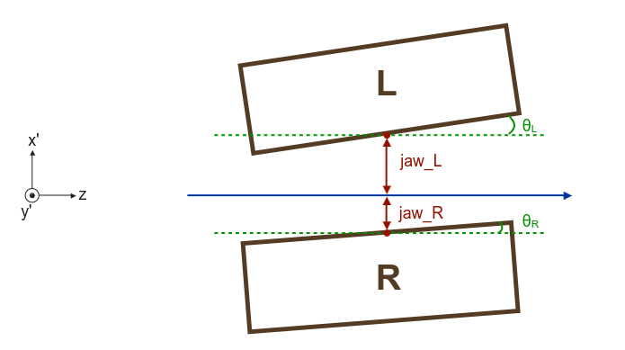
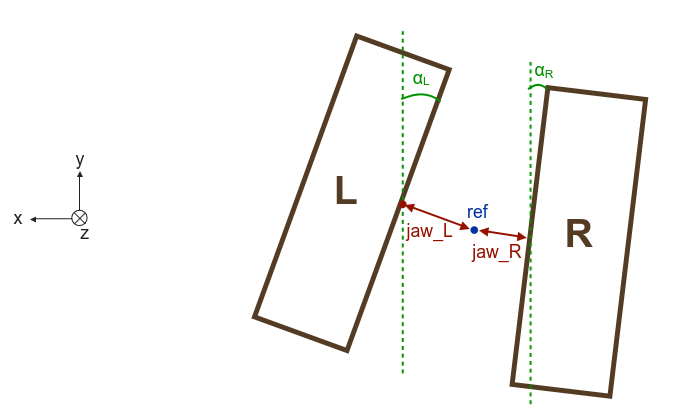
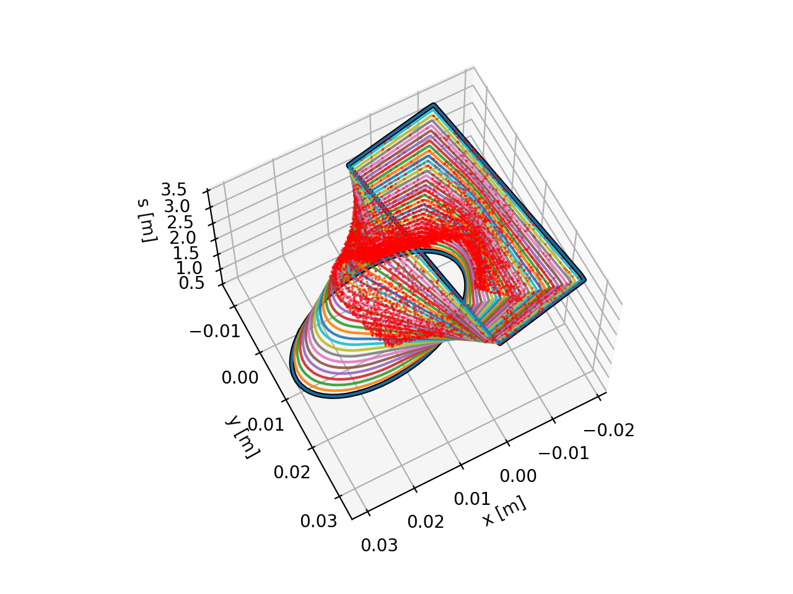

===========
Collimation
===========

.. contents:: Table of Contents
    :depth: 3

Introduction
============
In Xsuite, collimation is added to the simulations by the Xcoll package. 
The collimators themselves are created as instances of :class:`xcoll.EverestCollimator`, :class:`xcoll.EverestCrystal` and :class:`xcoll.BlackAbsorber`. In addition, we also have :class:`xcoll.EverestBlock`. The Xcoll package also describes the interaction between the particles and the collimators in the simulation. 

Loss maps are created after the simulations to assess the performance of the LHC collimation system. They give information about where the beam losses are located in the LHC. The loss map, after one simulation, is created as an instance of :class:`xcoll.LossMap`. 

Collimator objects
===================

BaseCollimator
--------------
Since :class:`xcoll.EverestCollimator`, :class:`xcoll.EverestCrystal` and :class:`xcoll.BlackAbsorber` describes different kinds of collimators they all inherit from the abstract class :class:`BaseCollimator` which contains all the basic attributes of a collimator. Some of these attributes, or fields, are made accessible to the C tracking code as seen in the code block below. 

.. code-block:: python

   class BaseCollimator(xt.BeamElement):
       _xofields = {
           'inactive_front': xo.Float64,  # Drift before jaws
           'active_length':  xo.Float64,  # Length of jaws
           'inactive_back':  xo.Float64,  # Drift after jaws
           'jaw_L':          xo.Float64,  # left jaw (distance to ref)
           'jaw_R':          xo.Float64,  # right jaw
           'ref_x':          xo.Float64,  # center of collimator reference frame
           'ref_y':          xo.Float64,
           'sin_zL':         xo.Float64,  # angle of left jaw
           'cos_zL':         xo.Float64,
           'sin_zR':         xo.Float64,  # angle of right jaw
           'cos_zR':         xo.Float64,
           'sin_yL':         xo.Float64,  # tilt of left jaw (around jaw midpoint)
           'cos_yL':         xo.Float64,
           'tan_yL':         xo.Float64,
           'sin_yR':         xo.Float64,  # tilt of right jaw (around jaw midpoint)
           'cos_yR':         xo.Float64,
           'tan_yR':         xo.Float64,
           '_side':          xo.Int8,     # is it a onesided collimator?
           'active':         xo.Int8
       }

However, to make things more user-friendly the :class:`BaseCollimator` has more properties defined in the class itself. These properties uses the fields from the code block above to define properties such as :meth:`jaw_LU`, :meth:`angle` and :meth:`tilt`. 

The collimator jaws are separated into the left and the right jaw, as seen defined in the code block above as well. In the figure below, you can see how 'jaw_L' and 'jaw_R' are defined. However, sometimes it is necessary to know, or change, the position of the corners of the collimator. The first pair of corners are called :meth:`jaw_LU` and :meth:`jaw_RU`, where the 'U' stands for upstream. The two remaining corners are defined as :meth:`jaw_LD` and :meth:`jaw_RD`, where the 'D' stands for downstream. Note that when setting the value of e.g. :meth:`jaw_RU` then :meth:`jaw_RD` is kept fixed while both 'jaw_R' and the tilt changes. 

.. code-block:: python

   collimatorObject.jaw
   collimatorObject.jaw_LU
   collimatorObject.jaw_RU
   collimatorObject.jaw_RD
   collimatorObject.jaw_RU

In addition, it is convenient to have the angle and the tilt of the jaws. The angle is the angle of the tilt of the jaws in the xy-plane while the tilt is the angle of the tilt of the jaws in the x'z-plane. For clarity, the angle is shown as alpha, and the tilt as theta in the images. Note that the tilt is in radians while the angle is in degrees.

.. code-block:: python

   collimatorObject.angle
   collimatorObject.angle_L
   collimatorObject.angle_R
   collimatorObject.tilt
   collimatorObject.tilt_L
   collimatorObject.tilt_R

Furthermore, it is also possible to get (and set) the length and the side of the collimator. 

.. code-block:: python

   collimatorObject.side
   collimatorObject.length

EverestCollimator
^^^^^^^^^^^^^^^^^
The :class:`EverestCollimator` contains all the same fields as :class:`BaseCollimator`, but in addition it also has these:

.. code-block:: python

   class EverestCollimator(BaseCollimator):
    _xofields = { **BaseCollimator._xofields,
        '_material':        Material,
        'rutherford_rng':   xt.RandomRutherford,
        '_tracking':        xo.Int8
    }

The new field of interest for the user is the material of the collimator. This is accessed by the method :meth:`EverestCollimator.material`. The material itself is an instance of :class:`xcoll.materials.Material`.

EverestCrystal
^^^^^^^^^^^^^^
:class:`EverestCrystal` has the same fields as :class:`BaseCollimator`, but in addition it has some extra fields which are needed to describe the crystal collimator. Note also that the material used for the crystal collimator is not the same as for :class:`xcoll.EverestCollimator`, but an instance of :class:`xcoll.materials.CrystalMaterial`.

.. code-block:: python

   class EverestCrystal(BaseCollimator):
       _xofields = { **BaseCollimator._xofields,
           'align_angle':        xo.Float64,  #  = - sqrt(eps/beta)*alpha*nsigma
           '_bending_radius':    xo.Float64,
           '_bending_angle':     xo.Float64,
           '_critical_angle':    xo.Float64,
           'xdim':               xo.Float64,
           'ydim':               xo.Float64,
           'thick':              xo.Float64,
           'miscut':             xo.Float64,
           '_orient':            xo.Int8,
           '_material':          CrystalMaterial,
           'rutherford_rng':     xt.RandomRutherford,
           '_tracking':          xo.Int8
       }

These new fields are accessed through the methods:

.. code-block:: python

   EverestCrystal.critical_angle
   EverestCrystal.bending_radius
   EverestCrystal.bending_angle
   EverestCrystal.material
   EverestCrystal.lattice

BlackAbsorber
^^^^^^^^^^^^^
:class:`xcoll.BlackAbsorber` is different from :class:`xcoll.EverestCollimator` and :class:`EverestCrystal`. The absorber has only one extra field compared to the :class:`xcoll.BaseCollimator`: 

.. code-block:: python

   class BlackAbsorber(BaseCollimator):
       _xofields = { **BaseCollimator._xofields,
           '_tracking':        xo.Int8
       }

BaseBlock and EverestBlock
==========================
:class:`xcoll.EverestBlock`, which inherit :class:`xcoll.BaseBlock`, describes a block with an infinite transversal length. This class has the fields:

.. code-block:: python

   class EverestBlock(BaseBlock):
    _xofields = { **BaseBlock._xofields,
        '_material':        Material,
        'rutherford_rng':   xt.RandomRutherford,
        '_tracking':        xo.Int8,
        '_only_mcs':        xo.Int8
    }
Furthermore, :class:`xcoll.EverestBlock` needs a material, which is an instance of :class:`xcoll.materials.Material`, and that can be accessed through 

.. code-block:: python
   EverestBlock.material

Creating a Collimator or Block object
============================
A collimator (or block) object can be created in two different ways; either directly with the class or by loading from file. 
For example:

.. code-block:: python

	import xcoll as xc
	
	block = xc.EverestBlock(length=1., material=xc.materials.Tungsten)
	collimator = xc.EverestCollimator(length=1., material=xc.materials.Tungsten)
	collimator_crystal = xc.EverestCrystal(length=1., material=xc.materials.SiliconCrystal)
	black_absorber = xc.BlackAbsorber(length=1., material=xc.materials.Graphite)

Or, by using the CollimationManager to load from file:

.. code-block:: python

   path_in  = xc._pkg_root.parent / 'examples'
   coll_manager = xc.CollimatorManager.from_yaml(path_in / 'colldb' / f'lhc_run3.yaml',
                                              line=line, beam=beam, _context=context)

   # Install collimators in line as black absorbers 
   coll_manager.install_everest_collimators(verbose=True)

Generating particles on a collimator 
====================================
For some collimation studies it is convenient to generate a initial pencil distribution on a collimator. Xcoll has its own function for this :meth:`xcoll.generate_pencil_on_collimator`. An example is shown below.

.. code-block:: python

	import xcoll as xc 
	import xpart as xp
        import xtrack as xt
	import numpy as np
	import json
	
	beam =  1
	plane = 'H'
	num_turns     = 200
	num_particles = 10000
	path_in  = xc._pkg_root.parent / 'examples'

	# Load from json
	with open(os.devnull, 'w') as fid:
    	   with contextlib.redirect_stdout(fid):
        	line = xt.Line.from_json(path_in / 'machines' / f'lhc_run3_b{beam}.json')
        
        # Initialise collmanager
	coll_manager = xc.CollimatorManager.from_yaml(path_in / 'colldb' / f'lhc_run3.yaml',
                                              line=line, beam=beam, _context=context)
	# Install collimators into line	
	coll_manager.install_everest_collimators(verbose=True)
	
	# Aperture model check
	print('\nAperture model check after introducing collimators:')
	with open(os.devnull, 'w') as fid:
    	    with contextlib.redirect_stdout(fid):
         	df_with_coll = line.check_aperture()
	assert not np.any(df_with_coll.has_aperture_problem)
	

	# Build the tracker
	coll_manager.build_tracker()
	# Set openings
	coll_manager.set_openings()
	
	tcp  = f"tcp.{'c' if plane=='H' else 'd'}6{'l' if int(beam)==1 else 'r'}7.b{beam}"
	emittance = coll_manager.colldb.emittance
	beta_gamma_rel = coll_manager.colldb._beta_gamma_rel
	part = xc.generate_pencil_on_collimator(line=line, emittance=emittance, beta_gamma_rel=bet, 
                                              collimator_name=tcp, num_particles=num_particles)
	
Lossmaps
========
Lossmaps are created as instances of :class:`xcoll.LossMap`. The lossmap itself and its summary are calculated when the object is created. It is also possible to save both the lossmap and summary to file with :meth:`xcoll.LossMap.to_json` and :meth:`xcoll.LossMap.save_summary`. For example: 

.. literalinclude:: generated_code_snippets/lhc_run3_lossmap.py
   :language: python

========================
Loss location refinement
========================

In Xtrack simulations particles are lost at defined aperture elements (e.g.
:class:`xtrack.LimitRect`, :class:`xtrack.LimitEllipse`, :class:`xtrack.LimitRectEllipse`,
:class:`xtrack.LimitPolygon`). A more accurate estimate of the loss locations can be
obtained after the tracking is finished using the
:class:`xtrack.LossLocationRefinement` tool . The tool builds
an interpolated aperture model between the aperture elements and backtracks the
particles in order to identify the impact point. The following example illustrates
how to use this feature.

See also: :class:`xtrack.LossLocationRefinement`

.. literalinclude:: generated_code_snippets/loss_location_refinement.py
   :language: python

    Generated transition between the defined apertures. Red dots represent the
    location of the particle-loss events. `See the code generating the image.
    <https://github.com/xsuite/xtrack/blob/main/examples/collimation/
    001_loss_location_refinement.py>`_

Beam interaction (generation of secondary particles)
====================================================

Xtrack includes an interface to ease the modeling of beam-matter interaction
(collimators, beam-gas, collisions with another beam),
including the loss of the impacting particles and the production of secondary
particles, which need to be tracked together with the surviving beam.
Such interface can be used to create a link with other programs for the modeling
of these effects,  e.g. GEANT, FLUKA, K2, GuineaPig.

The interaction is defined as an object that provides a ``.interact(particles)``
method, which sets to zero or negative the ``state`` flag for the particles that are lost and
returns a dictionary with the coordinates of the secondary particles that are
emitted. The interaction process is embedded in one or multiple
:class:`xtrack.BeamInteraction` beam elements that can be included in Xtrack line.

This is illustrated by the following example:

.. literalinclude:: generated_code_snippets/beam_interaction.py
   :language: python
