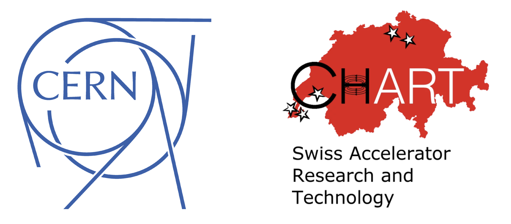

Contributors and acknowledgements
=================================

Xsuite is developed primarily at CERN with the support of the Swiss Accelerator
Research and Technology (CHART) program.

Contributors
------------

The following people contributed to the development of this package:

From CERN:
 - David Amorim
 - Andrey Abramov
 - Bernardo Abreu Figueiredo
 - Pablo Arrutia
 - Hannes Bartosik
 - Xavier Buffat
 - Simon Buijsman
 - Riccardo De Maria
 - Laurent Deniau
 - Colas Droin
 - Pascal Hermes
 - Lorenzo Giacomel
 - Giovanni Iadarola
 - Peter Kicsiny
 - Andrea Latina
 - Bjorn Lindstrom
 - Szymon Lopaciuk
 - Lotta Mether
 - Nicolas Mounet
 - Konstantinos Paraschou
 - Marcus Rognlien
 - John Patrick Salvesen
 - Martin Schwinzerl
 - Felix Soubelet
 - Guido Sterbini
 - Silke Van Der Schueren
 - Frederik Van Der Veken
 - Eskil Vik
 - Elias Waagaard

From other institutes:
 - Philippe Balanger (TRIUMF, Canada) - Development of wire beam element and Tracker.survey
 - Manon Boucard (EPFL, Switzwerland) - Development of the electron lens beam element
 - Kiel Hock (BNL, USA) - Development of spin tracking
 - Sebastien Joly (Helmholtz-Zentrum, Berlin) - Development of IBS + SR equilibrium calculation
 - Philipp Niedermayer (GSI, Germany) - Improve apertures API and docstrings, implement
   `Line.from_sequence`, implement `LastTurnsMonitor`, implement `Exciter`,
   implement `BeamSizeMonitor`, implement `BeamProfileMonitor`,
   implement `BeamPositionMonitor`,
 - Leon Van Riesen-Haupt (EPFL, Switzwerland) checks on synchrotron radiation spectrum.

Accelerator physics software
----------------------------

Xsuite is built on the experience of several pre-existing software packages
(a great deal could be learnt from  documentation, examples and source code).
These include:

- BMAD
- COMBI
- GUINEA-PIG
- HEADTAIL
- MAD-NG
- MAD-X
- Sixtrack
- Sixtracklib
- PLACET
- PyHEADTAIL
- PyWIT
- PyPIC
- PySSD
- PTC

References to literature used in the development of the code can be found in
bibliography of the :doc:`Xsuite Physics Guide <physicsguide>`.