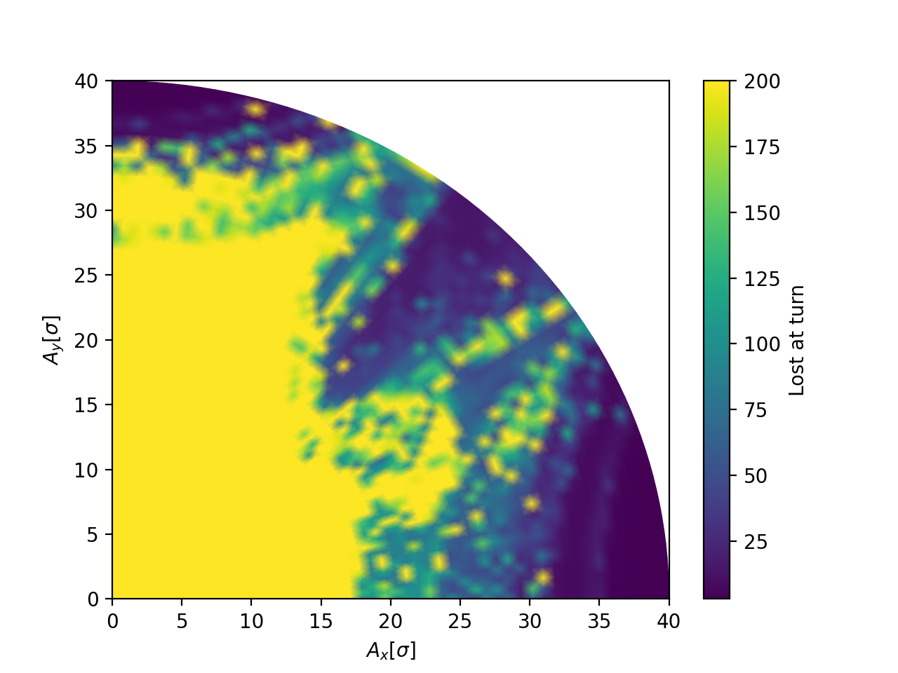

Dynamic aperture
================

The following example illustrate how to use Xsuite to study the Dynamic
Aperture of a ring.

.. literalinclude:: generated_code_snippets/tracking_for_da.py
   :language: python

    On-momentum dynamic aperture for the LHC lattice with octupoles active.