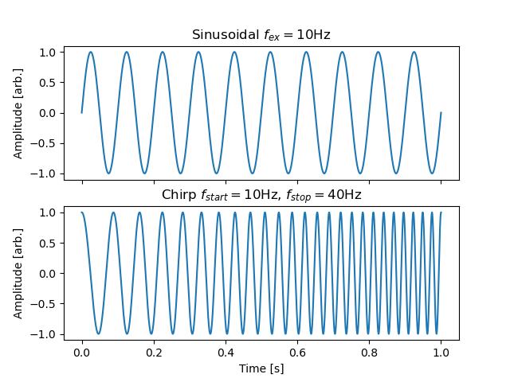

Exciter beam element
--------------------

The beam element :class:`xtrack.Exciter` provides a model for a transverse exciter as a time-dependent thin multipole. 

By providing an array of samples, and the sampling frequency, the element can provide an arbitrary excitation waveform.

This can be used for RFKO slow extraction, excitation tune measurement, power supply ripples, etc.

The given multipole components `knl` and `ksl` (normal and skew respectively) are multiplied according to an array of `samples` which allows for arbitrary time dependance:

.. math::
    \verb|knl|(t) = \verb|knl| \times \verb|samples|(t)

To provide for an arbitrary frequency spectrum, the variations are *not* assumed to be slow compared to the revolution frequency :math:`f_{rev}`, and the particle arrival time is taken into account when determining the sample index

.. math::
    \verb|i| = f_{samp} \times \left(\frac{n-n_0}{f_{rev}} - \frac{\zeta}{\beta_0  c_0}\right)

where :math:`\zeta=(s-\beta_0\cdot c_0\cdot t)` is the longitudinal coordinate of the particle, :math:`\beta_0` is the relativistic beta factor of the particle, :math:`c_0` is the speed of light, :math:`n` is the current turn number, :math:`f_{rev}` is the revolution frequency, and :math:`f_{samp}` is the sample frequency.

The excitation starts with the first sample when the reference particle arrives at the element in :math:`n_0`

The samples can therefore be considered as a waveform sampled at the sampling frequency. To compute a sample for a sinusoidal excitation at frequency `f_ex` using NumPy:

.. code-block:: python

    samples[i] = np.sin(2*np.pi*f_ex*i/sampling_freq)

To generate the full `samples` array at `sampling_freq` sampling frequency, for `n_turns` turns at `f_rev` revolution frequency:

.. code-block:: python

    total_time = n_turns / f_rev
    time = np.arange(0, total_time, 1/sampling_freq)
    samples = np.sin(2*np.pi*f_ex*time)

To generate a chirp array at `sampling_freq`, between frequencies `f_start` and `f_stop`, lasting `n_turns` turns at `f_rev` revolution frequency:

.. code-block:: python

    chirp_time = n_turns / f_rev
    time = np.arange(0, chirp_time, 1/sampling_freq)
    samples = sp.signal.chirp(time, f_start, chirp_time, f_stop)

To then define an Exciter element with the custom waveform (array of `samples` at sampling frequency `sampling freq`) and normal and skew components `KNL` and `KSL`:

.. code-block:: python

    # Create beam element
    exciter = xt.Exciter(_context = ctx,
        samples = samples,
        sampling_frequency = sampling_freq,
        duration = None,  # defaults to waveform duration
        frev = f_rev,
        start_turn = 0,  # default, seconds
        knl = KNL,
        ksl = KSL,
    )

    # Add it to the line for tracking as usual
    line.insert_element(
        element = exciter,
        name = 'RF_KO_EXCITER',
        index = 42,
    )

The optional parameter `duration` (seconds) may be used to repeat (or truncate) the excitation waveform. It defaults to `len(samples)/sampling_freq`, the duration of `samples`.

The element also provides the read-only parameter `order`, the multipole order, equal to the order of the largest non-zero multipole component `knl` or `ksl`.