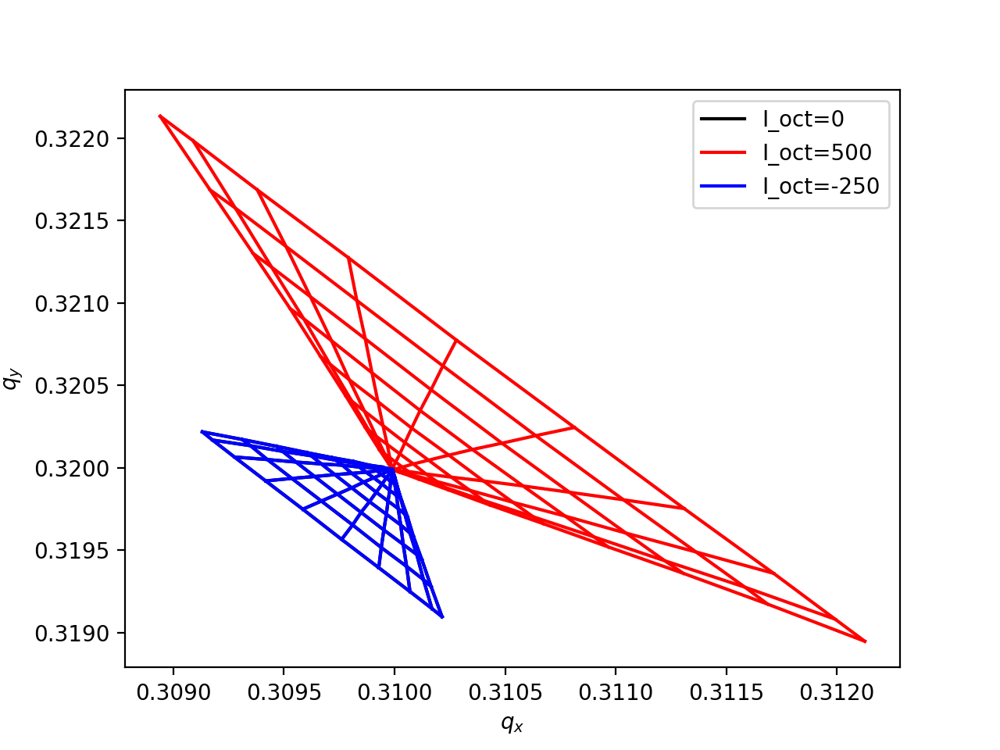
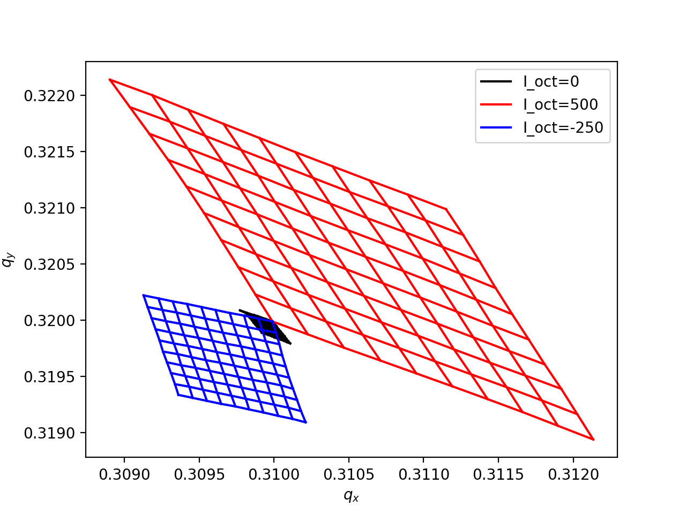
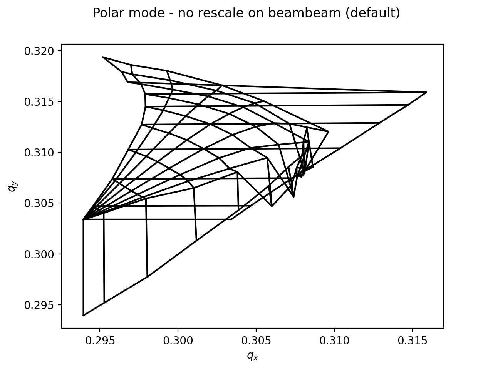
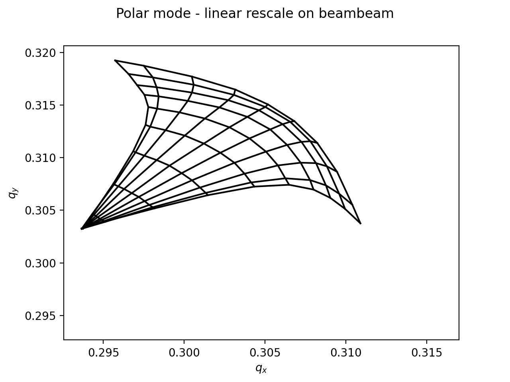
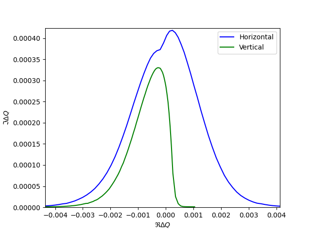

====================================
Tune footprint and stability diagram
====================================

The Line class provides a method to compute and optionally plot the tune footprint
as illustrated in the following example.

.. contents:: Table of Contents
    :depth: 3

Basic usage
===========

See also: :meth:`xtrack.Line.get_footprint`

.. literalinclude:: generated_code_snippets/footprint.py
   :language: python

    Footprints produced with a polar grid.

    Footprints produced with a uniform grid in action space.

Linear rescale on knobs
=======================

In some cases the effects introducing the detuning also introduce other effects
(e.g. coupling, or non-linear resonances) that disturb the particles tune
measurement. In this case it is possible to rescale quantify the detuning for
smaller values of the knobs associate to the detuning effects and rescale to
the actual value of the knob. This can be done by the `linear_rescale_on_knobs`
option as illustrated in the following example for a case where the detuning
with amplitude is introduced by beam-beam interactions.

See also: :meth:`xtrack.Line.get_footprint`

.. literalinclude:: generated_code_snippets/footprint_with_bb.py
   :language: python

    Footprints produced without rescaling beam-beam knob.

    Footprints produced with rescaling beam-beam knob.

Stability diagram
=================

Using the amplitude detuning given by the tune footprint, it is possible to 
evaluate numerically the dispersion integral from https://cds.cern.ch/record/318826 and
obtain the stability diagram as in https://doi.org/10.1103/PhysRevSTAB.17.111002.

If the context is :class:`xobjects.ContextCupy`, both the tracking and the numerical integration
are performed on the GPU.

 .. literalinclude:: generated_code_snippets/stabilitydiagram.py
    :language: python

