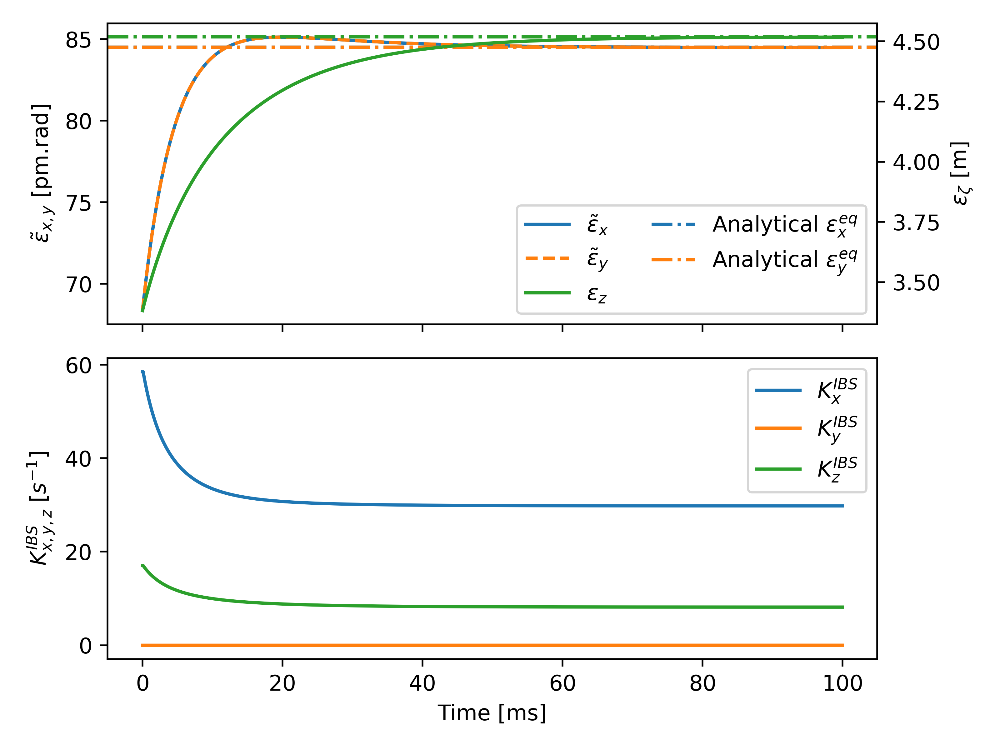
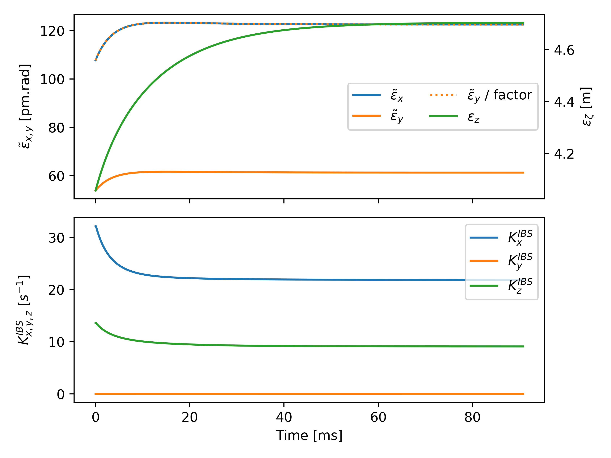

=====================
Intra-Beam Scattering
=====================

.. contents:: Table of Contents
    :depth: 3

Analytical Growth Rates
=======================

The following example illustrates how to obtain Intra-Beam Scattering growth rates in Xsuite.
The functionality is exposed directly through `xtrack.TwissTable` and can make use of two different formalism: ``Nagaitsev`` and ``Bjorken-Mtingwa``.
The former provides a computationally efficient approach but does not account for vertical dispersion, while the latter correctly accounts for it but is slower.

See also: :meth:`xtrack.twiss.TwissTable.get_ibs_growth_rates`

.. literalinclude:: generated_code_snippets/ibs_rates_with_vdisp.py
   :language: python

Amplitude and Emittance Conventions
-----------------------------------

For consistency with the computed Synchrotron Radiation damping times, in Xsuite the IBS *amplitude growth rates* are computed.
The following short example shows how to switch between the amplitude and emittance growth rates should one need to.

.. literalinclude:: generated_code_snippets/ibs_rates_conventions_switch.py
   :language: python

Steady State Emittances in the Presence of Synchrotron Radiation, Quantum Excitation and Intra-Beam Scattering
==============================================================================================================

The steady-state emittances in the presence of Synchrotron Radiation (SR), Quantum Excitation (QE), and Intra-Beam Scattering (IBS) emerge from a dynamic equilibrium, where the combined effect of these three phenomena balances each other out.
These emittances can be calculated in `Xsuite` by numerically solving a system of ordinary differential equations while enforcing constraints on the transverse emittances.
The ODE solved by the function are detailed in the :doc:`Physics guide<physicsguide>`.

See also: :meth:`xtrack.twiss.TwissTable.get_ibs_and_synrad_emittance_evolution`

In the following example, steady state emittances are calculated in the presence of a coupling constraint between transverse planes.
Notice how the coupling constraint of round beams (coupling factor = 1) is respected through the evolution of the emittances to the steady-state.

.. literalinclude:: generated_code_snippets/ibs_steady_state_emittances_coupling.py
   :language: python

This example, quite similar, shows how to do the same but with an excitation constraint between the transvserse planes.
Notice how this time a specific factor between transverse emittances is respected through their evolution to the steady-state.

.. literalinclude:: generated_code_snippets/ibs_steady_state_emittances_excitation.py
   :language: python

IBS Kicks for Tracking
======================

When trying to study the interplay of IBS effects with others such as space charge, e-cloud, beamb-beam etc. analytical growth rates are not enough and tracking becomes necessary.
In Xfields beam elements are provided to model IBS tracking, which apply momenta kicks to particles.
Two kick elements are available:

- ``IBSAnalyticalKick`` (based on `R. Bruce <https://journals.aps.org/prab/abstract/10.1103/PhysRevSTAB.13.091001>`_) for kicks based on analytical growth rates;
- ``IBSKineticKick`` (based on `P. Zenkevich <https://www.sciencedirect.com/science/article/abs/pii/S0168900206000465>`_, adapted by `M. Zampetakis <https://www.arxiv.org/abs/2310.03504>`_) for kicks based on diffusion and friction terms from the kinetic theory of gases.

The following example illustrates how to create a kick element, inserting and configuring it for tracking.
Refer to the :doc:`Reference manual<apireference>` for the full list of parameters and their explanation, and to the :doc:`Physics guide<physicsguide>` for full information.

See also: :meth:`xtrack.Line.configure_intrabeam_scattering`

.. literalinclude:: generated_code_snippets/ibs_kicks_tracking.py
   :language: python
