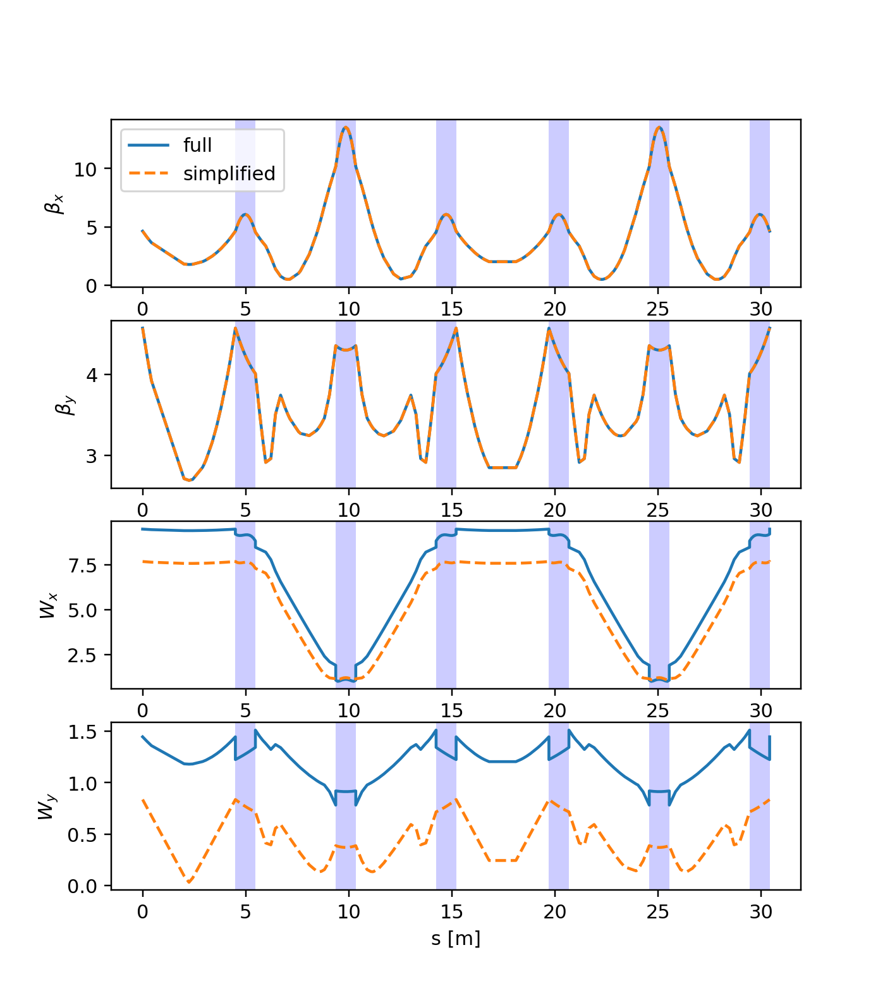

====
Line
====

.. contents:: Table of Contents
    :depth: 3

.. _createline:

Creating a Line object
======================

An Xsuite Line can be created by providing beam line element objects and the
corresponding names, as illustrated in the following example:

.. literalinclude:: generated_code_snippets/toy_ring.py
   :language: python

.. _madximport:

Importing a line from MAD-X
===========================

An Xsuite Line object can be imported from an existing MAD-X model, through the
`cpymad <http://hibtc.github.io/cpymad/>`_ interface of MAD-X, using the method
:meth:`xtrack.Line.from_madx_sequence`. The import of certain features of the MAD-X
model (dererred expressions, apertures, thick elements, alignment errors, field
errors, etc.) can be controlled by the user. This is illustrated in the following
example:

.. literalinclude:: generated_code_snippets/madx_import_psb.py
   :language: python

.. _seqdef:

Define a line through a sequence
================================

A line can also be defined through a "sequence", providing the element `s`
positions instead of explicit drifts, as show in the example below:

.. literalinclude:: generated_code_snippets/sequence.py
   :language: python

Line inspection, ``Line.get_table()``, ``Line.attr[...]``
========================================================

The following example illustrates how to inspect the properties of a line and 
its elements:

.. literalinclude:: generated_code_snippets/line_inspect.py
   :language: python

References and deferred expressions
===================================

Accelerators and beam lines have complex control paterns. For example, a single
high-level parameter can be used to control groups of accelerator components
(e.g., sets of magnets in series, groups of RF cavities, etc.) following complex
dependency relations. Xsuite allows including these dependencies in the simulation
model so that  changes in the high-level parameters are automatically propagated
down to the line elements properties. Furthermore, the dependency relations can
be created, inspected and modified at run time, as illustrated in the following
example:

.. literalinclude:: generated_code_snippets/expressions_basics.py
   :language: python

When importing a MAD-X model, the dependency relations from MAD-X deferred
expressions are automatically imported as well. The following example illustrates
how to inspect the dependency relations in a line imported from MAD-X:

.. literalinclude:: generated_code_snippets/expressions_madx.py
   :language: python

Save and reload lines
=====================

An Xtrack Line object can be transformed into a dictionary or saved to a json
file, as illustrated in the following example:

.. literalinclude:: generated_code_snippets/tojson.py
   :language: python

Element insertion
=================

.. literalinclude:: generated_code_snippets/insert_element.py
   :language: python

Element slicing
===============

It is possible to slice thick element with thin or thick slices, using the Uniform
or the `Teapot <https://cds.cern.ch/record/165372>`_ scheme. This is illustrated
in the following example:

.. literalinclude:: generated_code_snippets/slicing.py
   :language: python

Simulation of small rings: drifts, bends, fringe fields
=======================================================

The modeling of the body of bending magnets in automatically adapted depending
on the bending radius, hence no special setting is required for this purpose
when simulating small rings with large bending angles.

However, the modeling of the fringe fields and the drifts is not automatically
adapted and appropriate settings need to be provided by the user.

The following example illustrates how to switch to the full model for the fringe
fields and the drifts and compares the effect of different models on the optics
functions and the chromatic properties of the CERN ELENA ring:

.. literalinclude:: generated_code_snippets/elena_chromatic_functions.py
   :language: python

    Comparison of the simplified and full model for the CERN ELENA ring (the six
    bends of the ring are highlighted in blue). While
    the linear optics is well reproduced by the simplified model, the chromatic
    properties differ significantly (in particular, note the effect of the dipole
    edges).

Extraction of second order transfer maps
========================================

The method :meth:`xtrack.Line.get_line_with_second_order_maps` allows modeling portions
of a beam line with second order transfer maps. This is illustrated in the
following example.

See also :meth:`xtrack.SecondOrderTaylorMap.from_line`.

.. literalinclude:: generated_code_snippets/line_with_maps.py
   :language: python

Apply transformations (tilt, shift) to elements
===============================================

Tilt and shifts transformations can be applied to beam elements, as illustrated
in the following example:

.. literalinclude:: generated_code_snippets/compound_transform.py
   :language: python

Tranfromations are propagated when the elements are sliced and can be updated
also after the slicing by acting on the parent element. This is illustrated in
the following example:

.. literalinclude:: generated_code_snippets/compound_transform_sliced.py
   :language: python

Add multipolar components to elements
=====================================

Multipolar components can be added to thick beam elements, as illustrated in the
following example:

.. literalinclude:: generated_code_snippets/multipolar_components.py
   :language: python

Multipolar components are propagated when the elements are sliced and can be updated
also after the slicing by acting on the parent element. This is illustrated in
the following example:

.. literalinclude:: generated_code_snippets/multipolar_components_sliced.py
   :language: python

Cut line elements at given s positions
======================================

The method :meth:`xtrack.Line.cut_at_s` allows for cutting the line elements at the
specified s positions. In the example before we take the same toy ring introduced
in the :ref:`earlier example<createline>` and we cut it into 100 equal length slices:

.. literalinclude:: generated_code_snippets/cut_at_s.py
   :language: python
