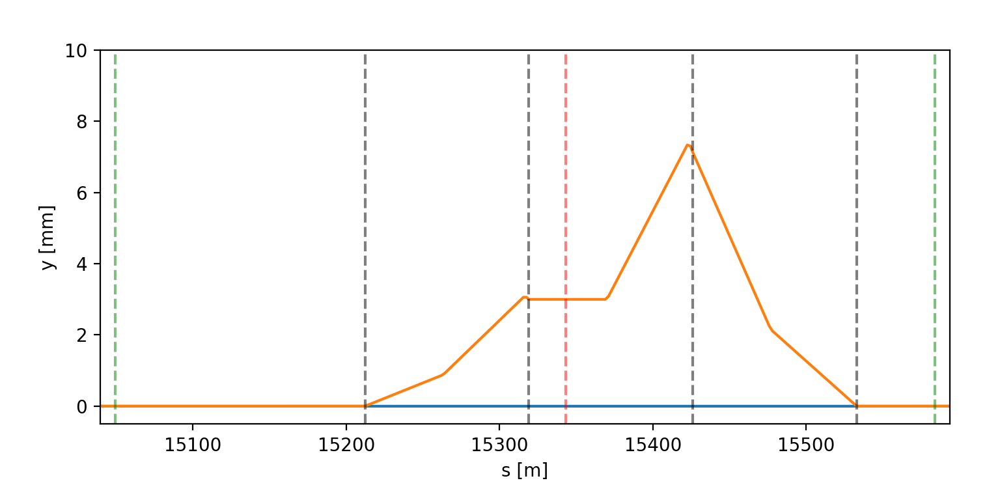
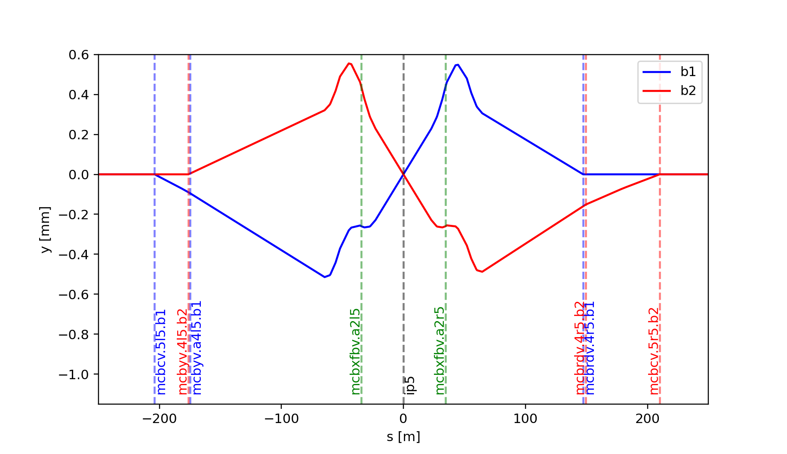
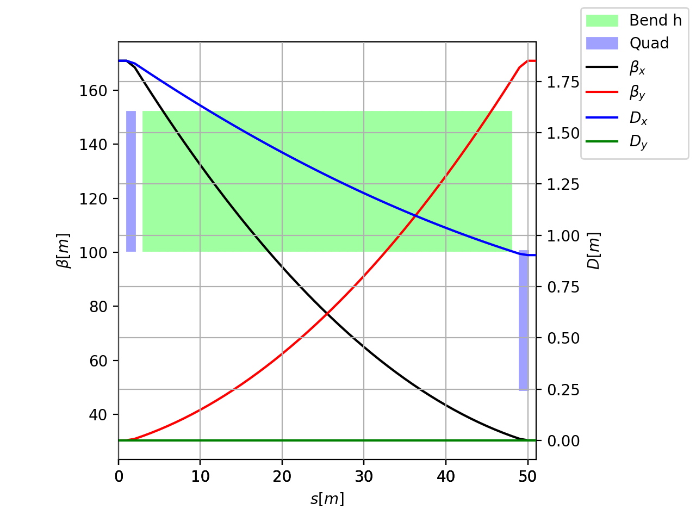

=====
Match
=====

The Xtrack Line class provides a match method that allows using a numerical optimizer
to adjust knobs attached to the line in order to obtain desired values
in the twiss results (or as a result of other user-defined actions).

.. contents:: Table of Contents
    :depth: 3

Basic usage
-----------

The numerical optimizer can be used calling the method :meth:`xtrack.Line.match`.
The optimization is define by a set of :ref:`Vary and Target objects  <vary_target_label>` defining the
knobs to be varied and the targets to be matched. Arguments not specific of the
match method are automatically dispatched to the underlying twiss calls.
The following example shows how to match the tunes and chromaticities of a ring.

.. literalinclude:: generated_code_snippets/match_basic.py
   :language: python

Match at specific locations
---------------------------

See also :meth:`xtrack.Line.match`

The match method can also be used on a portion of a beam line and/or with
targets at specific locations. By default the provided boundary conditions are
imposed at the start of the specified range. The constants ``xt.START`` and
``xt.END`` can be used to specify targets at the start and end of the range
respectively. This is illustrated in the following example, showing how to
match a closed orbit bump in a given beamline range.

.. literalinclude:: generated_code_snippets/match_bump_basic.py
   :language: python

Alternatively, the boundary conditions can be imposed at the end or within
the specified range as illustrated in the following examples.

.. literalinclude:: generated_code_snippets/match_bump_init_end.py
   :language: python

.. literalinclude:: generated_code_snippets/match_bump_init_middle.py
   :language: python

    The orbit bump from the three examples above.

Boundary conditions and target values from existing table
---------------------------------------------------------

See also :meth:`xtrack.Line.match`

Boundary conditions and target values used for the matching can be obtained
also from an existing TwissTable object, as illustrated in the following example.

.. literalinclude:: generated_code_snippets/match_bump_from_table.py
   :language: python

Match involving multiple lines
------------------------------

See also :meth:`xtrack.Line.match`

The match method can also be used to match multiple lines at the same time.
This is illustrated in the following example, showing how to match orbit bumps
in the two beams of a collider to obtain a given crossing angle between the
two beams. Some of the used dipole magnets are shared between the two beams.

.. literalinclude:: generated_code_snippets/match_bump_common_elements.py
   :language: python

    The orbit bump from the example above. The corrector magnets indicated in
    green act on both beams.

Callables and inequalities in targets
-------------------------------------

See also :meth:`xtrack.Line.match`

Targets can contain also callables and inequalities. This is illustrated in the
following example, showing the match of crossing bump (as in the previous section)
where we use a callable to match the average angle at the IP to zero and
inequalities to impose a minimum and maximum value for the angle of one beam
at the IP.

.. literalinclude:: generated_code_snippets/match_bump_common_ele_callable_ineq.py
   :language: python

Matching on results of arbitrary actions
----------------------------------------

See also :meth:`xtrack.Line.match`

By default the quantities used as match targets are found in the result of the
twiss method. It is nevertheless possible to use the match method on results of
arbitrary user-defined "actions". Each action is defined by writing a small python
class inheriting from :class:`xtrack.Action` providing a method called ``run``,
called at each optimization step, which returns a dictionary of quantities that
can be used as targets. This is illustrated by the following example, showing
how to use octupole magnets to control the detuning with amplitude coefficients
(``det_xx = dqx/dJx`` and ``det_yy = dqy/dJy``) as obtained by tracking.

.. literalinclude:: generated_code_snippets/match_action.py
   :language: python

Interactive match
-----------------

See also :meth:`xtrack.Line.match`

The match method can also be used in an interactive way passing `solve=False`
to the :meth:`xtrack.Line.match`. In this case an :class:`xdeps.Optimize` object
is returned that can be used to interactively drive the optimization process,
by enabling/disabling knobs and targets, changing target values and tolerances,
controlling the number of optimization steps, tagging and reloading specific
optimization steps. This is illustrated in the following example.

.. literalinclude:: generated_code_snippets/match_interactive.py
   :language: python

Create new knobs by matching
----------------------------

See also :meth:`xtrack.Line.match_knob`

The :meth:`xtrack.Line.match_knob` method allows generating new knobs based on
the result of an optimization. The user can specify a value for
``knob_value_start`` corresponding to the line state before the optimization,
and a value for ``knob_value_end`` corresponding to the line state after the
optimization. A linear interpolation is used when a different value of the knob
is set. This shown by the following example, which shows how to build knobs
controlling the horizontal and vertical chromaticities of a line.

.. literalinclude:: generated_code_snippets/match_knob.py
   :language: python

Targets from variables and from line elements
---------------------------------------------

Targets for optimization can be defined also from variables and from from the
lines, as illustrated in the following example.

.. literalinclude:: generated_code_snippets/match_targets_from_vars_or_line.py
   :language: python

Match and twiss with symmetry constraints on one boundary
---------------------------------------------------------

In some cases, it is useful to twiss or match a line with periodicity constraints
on one of the boundary and symmetry constraints on the other boundary, for example
to design a symmetric cell in a periodic lattice.
This can be achived by building only one half of the period and passing
`init="periodic_symmetric"` to the `match` and `twiss` methods,
as illustrated in the following example.

.. literalinclude:: generated_code_snippets/symm_twiss_and_match.py
   :language: python

   Half lattice cell matched with periodic boundary conditions on the left side and symmetry boundary conditions on the right side.
