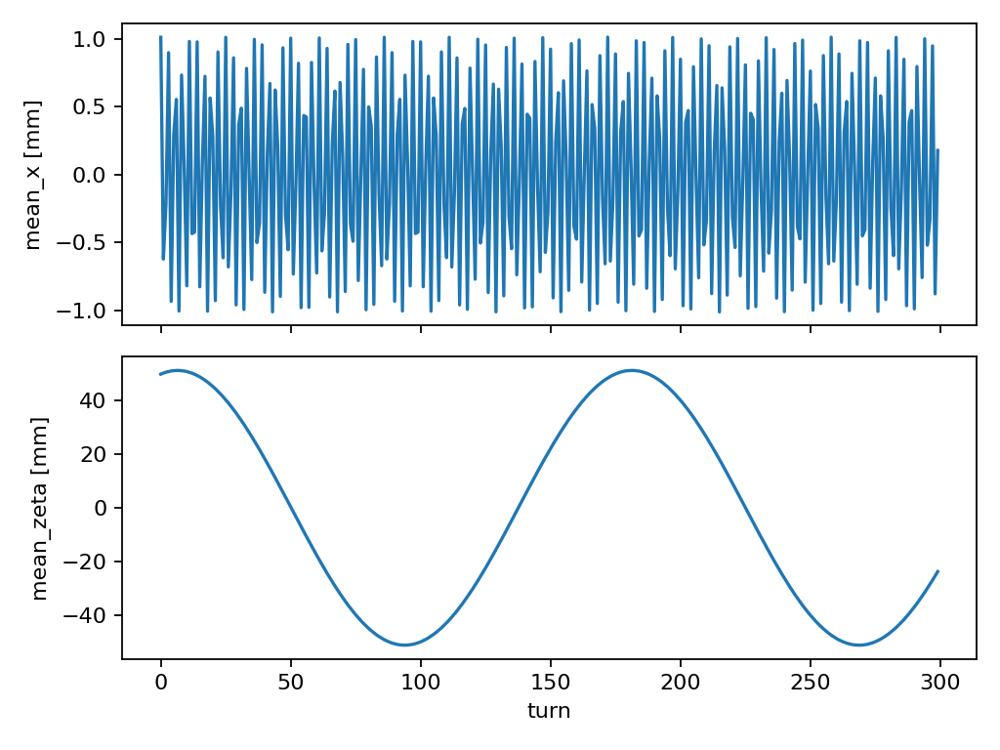
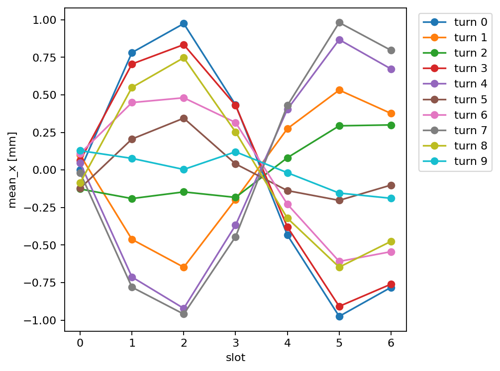
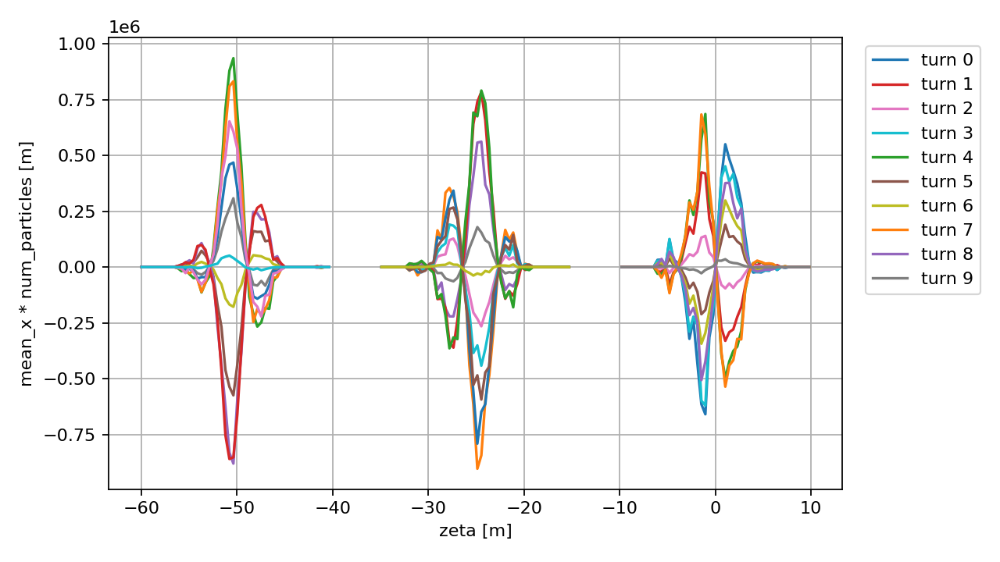
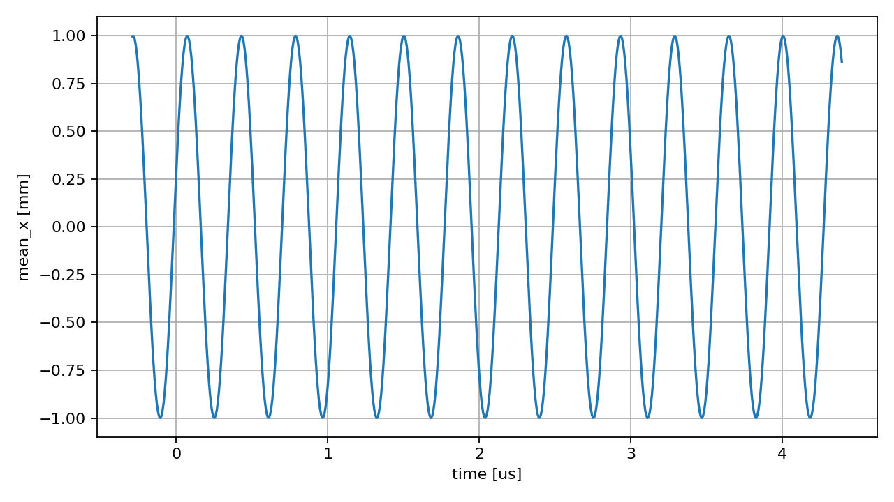
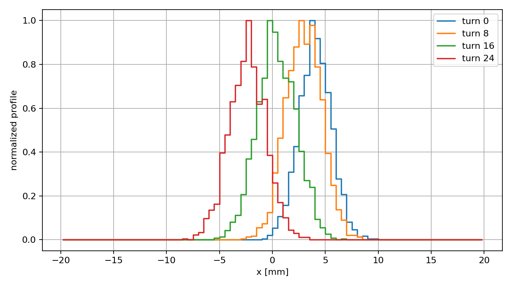
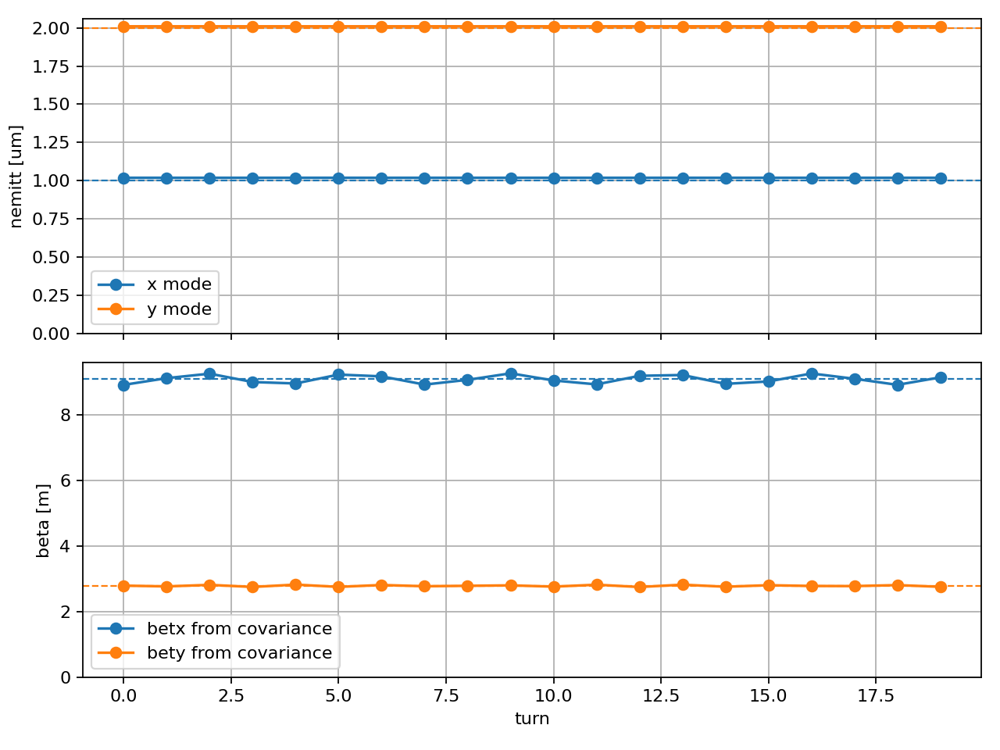

.. _monitors:
.. _particles-monitors:

Particles Monitors
==================

The :class:`xtrack.ParticlesMonitor` records particle coordinates over selected
turns. It can be used through the default turn-by-turn monitor, configured as a
custom monitor, or inserted as a beam element.

The easy way
------------

When starting a tracking simulation with the Xtrack Line object, the easiest
way of logging the coordinates of all particles for all turns is to enable the
default turn-by-turn monitor, as illustrated by the following example.
Note: this mode requires that ``particles.at_turn`` is ``0`` for all particles
at the beginning of the simulation.

.. literalinclude:: generated_code_snippets/quick_monitor.py
   :language: python

Custom monitors
---------------

In order to customize the monitor's behaviour,
a custom monitor object can be built and passed to the ``Line.track``
function.

Particles coordinates can be recorded only in a selected range of turns
by specifying ``start_at_turn`` and ``stop_at_turn``.
The monitoring can also be limited to a selected range of particles IDs,
by using the argument ``particle_id_range`` of the ``ParticlesMonitor`` class
to provide a tuple defining the range to be recorded. In that case the
``num_particles`` input of the monitor is omitted.

The example above is changed as follows:

.. code-block:: python

    ...

    monitor = xt.ParticlesMonitor(_context=context,
        particle_id_range=(5, 42),
        start_at_turn=5, # <-- first turn to monitor (including)
        stop_at_turn=15, # <-- last turn to monitor (excluding)
    )

    line.track(particles, num_turns=num_turns,
               turn_by_turn_monitor=monitor, # <-- pass the monitor here
    )

Now, ``line.record_last_track.x[3, 5]`` gives the x coordinates for the
particle 3 (which has the id 8) and the
recorded turn 5 (which is turn number 10)
The particle ids that are recorded can be inspected in ``line.record_last_track.particle_id``
and the turn indeces in ``line.record_last_track.at_turn``.

**Multi-frame particles monitor**

The particles monitor can also record periodically spaced intervals of turns (frames)
This feature can be activated by providing the arguments ``n_repetitions`` and
``repetition_period`` when creating the monitor.
In the following example, we record turns in range 5 to 10 (first frame),
range 25 to 30 (second frame) and range 45 to 50 (third frame).
Note that each frame consists of 5 turns since ``stop_at_turn`` is excluding.

.. code-block:: python

    monitor = xt.ParticlesMonitor(_context=context,
        num_particles=num_particles,
        start_at_turn=5,
        stop_at_turn=10,
        n_repetitions=3,      # <--
        repetition_period=20, # <--
    )

Now, the measured data are 3D array with the first index being the frame number.
For example, ``line.record_last_track.x[0, :, :]`` contains the recorded
x position for the first frame (turns 5, 6, 7, 8 and 9) and
``line.record_last_track.x[-1, :, 0]`` refers to the last frame and the first turn within,
which is turn number turn 25.
As before, the turn numbers recorded can be inspected with ``line.record_last_track.at_turn``.

Particles monitor as beam elements
----------------------------------

Particles monitors can be used as regular beam element to record the particle
coordinates at specific locations in the beam line. For this purpose they can be
inserted in the line, as illustrated in the following example.

.. literalinclude:: generated_code_snippets/monitors_as_beam_elements.py
   :language: python

As all Xtrack elements, the Particles Monitor has a track method and can be used
in stand-alone mode as illustrated in the following example.

.. code-block:: python

    # line.track(particles, num_turns=num_turns)
    for iturn in range(num_turns):
        monitor.track(particles)
        line.track(particles)

Multi-element monitor
---------------------

It is possible to log particle coordinates at multiple selected elements in the
beamline for all tracked turns. This can be activated by adding the argument
``multi_element_monitor_at`` when calling the track method of the Line object.
This is illustrated in the following example, where the coordinates are recorded
at all BPMs of a ring.

.. literalinclude:: generated_code_snippets/multi_element_monitor.py
   :language: python

.. _beam-statistics-monitor:

Beam Statistics Monitor
=======================

The :class:`xtrack.BeamStatsMonitor` records weighted beam statistics for the
whole beam, per bunch, or per longitudinal slice. It is intended for diagnostics
such as intensity, centroids, beam sizes, covariances, and projected
emittances.

See also: :ref:`BeamStatsMonitor API reference
<beamstatsmonitor-api-reference>`.

The quantity ``num_particles`` is the sum of ``particles.weight`` in each bin,
not the number of macroparticles. All statistics are computed with the same
weights.

The monitor exposes the most detailed level available from its constructor
inputs. With no bunch or slice inputs, recorded arrays have shape:

.. code-block:: text

    (n_logged_turns,)

With bunch inputs and no slice inputs, recorded arrays have shape:

.. code-block:: text

    (n_logged_turns, n_selected_slots)

With slice inputs, recorded arrays have shape:

.. code-block:: text

    (n_logged_turns, n_selected_slots, num_slices)

The ``level`` argument of :meth:`xtrack.BeamStatsMonitor.get` selects a
reduction level:

.. code-block:: python

    monitor.get("mean_x", level="beam")
    monitor.get("mean_x", level="bunch", slot=3)
    monitor.get("mean_x", level="slice", slot=3, slice_index=12)

The examples below also show the main inspection tools:
``monitor.stats`` lists the recorded quantities, ``monitor.available_levels``
lists the available aggregation levels, ``monitor.default_level`` gives the
level returned by statistic attributes, ``monitor.turns`` maps the first array
axis to machine turns, ``monitor.zeta_centers`` gives the slice coordinates
when slices are available, and each requested statistic is available both as an
attribute and through ``monitor.get("stat_name")``.

Whole-beam stats
----------------

The following example records stats for the full beam over a subset of
turns in a PIMMS lattice with an RF cavity added, and plots ``mean_x`` and
``mean_zeta`` as a function of turn. No ``zeta_range`` or ``num_slices`` is
needed.

.. literalinclude:: generated_code_snippets/beam_stats_monitor_beam_stats.py
   :language: python

   Evolution of the horizontal and longitudinal beam centroids recorded with
   ``BeamStatsMonitor``.

Bunch-by-bunch stats
--------------------

The following example records stats for a bunch train generated from a matched
Gaussian bunch. A sinusoidal horizontal offset is applied to the initial bunch
centroids, and the recorded arrays are inspected and plotted as
bunch-by-bunch profiles over consecutive turns. No ``zeta_range`` or
``num_slices`` is needed.

.. literalinclude:: generated_code_snippets/beam_stats_monitor_bunch_by_bunch_stats.py
   :language: python

   Horizontal bunch centroids over consecutive turns, recorded with
   ``BeamStatsMonitor``.

Slice-by-slice stats
--------------------

Providing ``zeta_range`` and ``num_slices`` enables slice mode. This can be
combined with ``filled_slots``, ``selected_slots``, and
``bunch_spacing_zeta`` to record slice-by-slice statistics for multiple
physical bunch slots. In this mode the most detailed recorded arrays have axes
``(turn, selected slot, slice)``. The following example generates a
multi-bunch beam, imposes a horizontal sinusoidal pattern with a wavelength
comparable to the bunch spacing, and plots ``mean_x * num_particles`` versus
absolute ``zeta`` for a few consecutive bunches and turns. Per-bunch and
whole-beam statistics remain available through
``monitor.get(..., level="bunch")`` and ``monitor.get(..., level="beam")``.

.. literalinclude:: generated_code_snippets/beam_stats_monitor_slice_by_slice_stats.py
   :language: python

   Slice-by-slice horizontal dipole moment recorded for three bunches with
   ``BeamStatsMonitor``.

Coasting-beam stats
-------------------

For a coasting beam, pass ``coasting=True`` together with ``num_slices``. The
monitor slices the full machine turn periodically. In this mode no
``zeta_range``, filling scheme, selected slots, or
``bunch_spacing_zeta`` is needed. Particles whose ``zeta`` coordinate is
outside one circumference are wrapped into the corresponding recorded turn.

The default recorded arrays have axes ``(turn, slice)``. Since the physical
slice coordinates depend on the machine circumference, ``monitor.zeta_centers``
is ``None`` in coasting mode and no bunch level is exposed. Use
:meth:`xtrack.BeamStatsMonitor.time_centers` or
:meth:`xtrack.BeamStatsMonitor.zeta_centers_unwrapped` with the line length to
plot data over multiple turns.

The following example uses the PIMMS lattice, creates a coasting distribution
spanning one turn, imposes a tune-matched sinusoidal horizontal modulation as a
function of ``zeta``, tracks the beam for several turns, and plots the recorded
slice centroids with unwrapped time coordinates.

.. literalinclude:: generated_code_snippets/beam_stats_monitor_coasting_beam_stats.py
   :language: python

   Coasting-beam horizontal centroid recorded over multiple turns with
   ``BeamStatsMonitor``.

Beam profiles
-------------

The same monitor can also record weighted beam profiles. Pass a ``profiles``
dictionary whose keys are particle coordinates and whose values define the
profile ``range`` and ``num_bins``. The key is the coordinate to histogram; for
example ``"x"`` records the horizontal profile and ``"delta"`` records the
momentum-deviation profile.

Profile counts are weighted in the same way as ``num_particles``. The bin
metadata and counts are available through dictionaries keyed by coordinate:

.. code-block:: python

    monitor.profile_bin_edges["x"]
    monitor.profile_bin_centers["x"]
    monitor.profiles["x"]

The profile arrays use the same leading axes as the most detailed statistics,
with one additional trailing profile-bin axis. For example, whole-beam profile
data have shape ``(turn, profile_bin)``, bunched slice profile data have shape
``(turn, selected slot, slice, profile_bin)``, and coasting profile data have
shape ``(turn, slice, profile_bin)``.

The following example records scalar beam statistics together with horizontal
and momentum profiles. A horizontal offset is applied to the bunch before
tracking, and the recorded horizontal profile is plotted at selected turns.

.. literalinclude:: generated_code_snippets/beam_stats_monitor_beam_profiles.py
   :language: python

   Horizontal beam profiles recorded at selected turns with
   ``BeamStatsMonitor``.

Emittance and optics from covariance
------------------------------------

Requesting normal-mode emittance or covariance-optics quantities makes
``BeamStatsMonitor`` store the full 6D covariance moment set in the canonical
coordinate order ``(x, px, y, py, zeta, pzeta)``. These quantities can be
requested explicitly, combined with projected emittances such as
``nemitt_x_projected``, and mixed with ordinary beam statistics such as
``mean_x`` and ``sigma_x`` in the same monitor. The tracking kernel still
records only weighted primitive moments; normal-mode emittances, beta
functions, alpha functions, and dispersions are computed afterwards from the
measured covariance matrix.

The normal-mode emittances, for example ``nemitt_x``, are obtained from the
full coupled 6D covariance matrix. The projected emittances, for example
``nemitt_x_projected``, are instead computed from the corresponding 2D
coordinate-plane covariance. The normalized projected emittance is obtained by
multiplying the geometric projected emittance by the weighted average of
``beta0 * gamma0``. The same convention is used for ``y`` and for the
longitudinal ``(zeta, pzeta)`` plane.

The following example generates a matched Gaussian bunch, records the
covariance-derived quantities turn by turn, and compares the measured beta
functions at the monitor location with the model Twiss values. The requested
scalar arrays are available as ordinary monitor attributes such as
``monitor.mean_x``, ``monitor.nemitt_x``,
``monitor.nemitt_x_projected``, and ``monitor.betx``.

.. literalinclude:: generated_code_snippets/beam_stats_monitor_emittance_and_optics.py
   :language: python

   Normal-mode emittances and beta functions reconstructed turn by turn from
   the covariance measured with ``BeamStatsMonitor``.

Saving to file during a simulation
----------------------------------

The monitor can also write the requested statistics to an HDF5 file.
When ``output_file`` is passed to the constructor, the file is initialized in
write mode immediately. Calling :meth:`xtrack.BeamStatsMonitor.save_to_file`
during tracking appends only the records that have not already been written,
while the full configured monitor frame remains available in memory.

The saved HDF5 file is a flat time series. The recorded turns are stored in
``/turns`` and the statistics are stored under ``/stats/<level>/<stat>``. Since
each save operation flushes and closes the file, another script can reopen it
between saves to inspect partial results. The following example uses a
bunch-by-bunch monitor, tracks in chunks, saves after each chunk, and reads
both the reduced beam-level data from ``/stats/beam`` and the bunch-level data
from ``/stats/bunch``.

.. literalinclude:: generated_code_snippets/beam_stats_monitor_save_to_file.py
   :language: python

Saving long simulations with frame reuse
----------------------------------------

For simulations where a full run would be too large to keep in one monitor
allocation, the user can save one frame, clear the in-memory arrays, and reuse
the same monitor for the next turn interval with
:meth:`xtrack.BeamStatsMonitor.start_new_frame`. This frame-reuse helper is not
available in coasting mode. The HDF5 file remains unaware of frames: each call
to :meth:`xtrack.BeamStatsMonitor.save_to_file` appends the new records to the
same flat ``/turns`` and ``/stats`` datasets.

The following example keeps only 20 turns in memory at a time while saving 60
turns to the file. After the loop, the monitor contains the last frame only,
whereas the file contains all saved turns.

.. literalinclude:: generated_code_snippets/beam_stats_monitor_save_new_frame.py
   :language: python

.. _legacy-monitors:

Legacy monitors
===============

The monitors below are kept for compatibility with existing workflows. For new
beam-statistics use cases, prefer :class:`xtrack.BeamStatsMonitor`.

Last turns monitor
------------------

The :class:`xtrack.LastTurnsMonitor` records particle data in the last turns before respective particle loss
(or the end of tracking).

The idea is to use a rolling buffer instead of saving all the turns. This saves a lot of memory resources
when the interest lies only in the last few turns.
For each particle, the recorded data will cover up to ``n_last_turns*every_n_turns`` turns before it is lost (or the tracking ends).

.. code-block:: python

    monitor = LastTurnsMonitor(
        particle_id_range=(0, 5),  
        n_last_turns=5,            # amount of turns to store
        every_n_turns=3,           # only consider turns which are a multiples of this
    )

    ... # track

    monitor.at_turn[:,-1]  # turn number of each particle before it is lost (last turn alive)
    monitor.x[3,-2]        # x coordinate of particle 3 in one but last turn (-2)

The monitor provides the following data as 2D array of shape ``(num_particles, n_last_turns)``,
where the first index corresponds to the particle in ``particle_id_range``
and the second index corresponds to the turn (or every_n_turns) before the respective particle is lost:
``particle_id``, ``at_turn``, ``x``, ``px``, ``y``, ``py``, ``delta``, ``zeta``

.. _MonitorBPM:

Beam position monitor
---------------------

The :class:`xtrack.BeamPositionMonitor` records transverse beam positions,
i.e. it stores the x and y centroid positions of particles.
This can be useful for tune or beam-transfer-function diagnostics
as well as transverse schottky spectra.

The monitor allows for arbitrary sampling frequencies and can thus not only be used for
bunch positions, but also coasting beam positions. Higher sampling frequencies give
access to transverse beam oscillations at higher harmonics, which is especially useful
for schottky diagnostics.
Internally, the particle arrival time is used when determining the record index.
For coasting beams this ensures, that the centroid is computed considering all particles
which arrive at the monitor at the same time (as in a real-world measurement device), even
if some particles might have made more or less turns than the synchronous particle due to
a non-negligible momentum deviation.

.. math:: 
    i = f_{samp} \times \left(\frac{n-n_0}{f_{rev}} - \frac{\zeta}{\beta_0  c_0}\right)

where
:math:`f_{samp}` is the sampling frequency,
:math:`f_{rev}` is the revolution frequency,
:math:`n` is the current turn number and :math:`n_0` is the first turn recorded,
:math:`\zeta=(s-\beta_0\cdot c_0\cdot t)` is the longitudinal ``zeta`` coordinate of the particle,
:math:`\beta_0` is the relativistic beta factor of the particle
and :math:`c_0` is the speed of light.
For non-circular lines :math:`n` is always zero and :math:`f_{rev}` can be omitted.

Note that the index is rounded, i.e. the result array represents data of particles
equally distributed around the reference particle, which is useful for bunched beams.
For example, if the sampling frequency is twice the revolution frequency,
the first item contains data from particles in the range zeta/circumference = -0.25 .. 0.25,
the second item in the range 0.25 .. 0.75 and so on.

.. code-block:: python

    monitor = xt.BeamPositionMonitor(
        #particle_id_range=(5, 42),        # optional, defaults to all particles if not given
        start_at_turn=5, stop_at_turn=10,  # turn refers to the synchronous particle (at zeta=0)
        frev=1e6,                          # revolution frequency (only for circular lines)
        sampling_frequency=2e6,            # sampling frequency
    )

    ... # track

    print(monitor.count)   # waveform of number of particles (intensity)
    print(monitor.x_mean)  # waveform of horizontal centroid positions (alias monitor.x_cen)
    print(monitor.y_mean)  # waveform of vertical centroid positions (alias monitor.y_cen)

The result arrays can be understood as waveforms recorded at the specified sampling frequency.
In the special case where sampling frequency was set to the same value as the revolution frequency,
the indices are identical to the recorded turn numbers (of the synchronous particle).

Beam size monitor
-----------------

The :class:`xtrack.BeamSizeMonitor` records transverse beam sizes,
i.e. it stores the standard deviation of the particles x and y positions.

Like the :ref:`MonitorBPM` also the beam size monitor is based on particle arrival time and an arbitrary sampling frequency.

.. code-block:: python

    monitor = xt.BeamSizeMonitor(
        #particle_id_range=(5, 42),        # optional, defaults to all particles if not given
        start_at_turn=5, stop_at_turn=10,  # turn refers to the synchronous particle (at zeta=0)
        frev=1e6,                          # revolution frequency (only for circular lines)
        sampling_frequency=2e6,            # sampling frequency
    )

    ... # track

    print(monitor.count)   # waveform of number of particles (intensity)
    print(monitor.x_mean)  # waveform of horizontal centroid positions
    print(monitor.y_std)   # waveform of vertical position standard deviation (i.e. beam size)
    print(monitor.x_var)   # waveform of horizontal position variances

Beam profile monitor
--------------------

The :class:`xtrack.BeamProfileMonitor` records transverse beam profiles,
i.e. it stores the number of particles on a defined raster (like a histogram).

Like the :ref:`MonitorBPM` also the beam profile monitor is based on particle arrival time and an arbitrary sampling frequency.

.. code-block:: python

    monitor = xt.BeamProfileMonitor(
        #particle_id_range=(5, 42),        # optional, defaults to all particles if not given
        start_at_turn=5, stop_at_turn=10,  # turn refers to the synchronous particle (at zeta=0)
        frev=1e6,                          # revolution frequency (only for circular lines)
        sampling_frequency=2e6,            # sampling frequency
        n=100,                             # number of bins in the profile (can also specify nx and ny separately)
        x_range=(-4,2),                    # save horizontal profile extending from -4 to 2
        y_range=5,                         # shorthand for (-2.5, 2.5)
    )

    ... # track

    print(monitor.x_edges)      # the bin edges
    print(monitor.x_grid)       # the bin midpoints
    print(monitor.x_intensity)  # the actual profile (particle count per bin)

The recorded profiles are 2D arrays of shape ``(sample_size, n)``
where ``sample_size = round(( stop_at_turn - start_at_turn ) * sampling_frequency / frev)``.
I.e. ``monitor.x_intensity[0,:]`` is the first recorded profile and ``monitor.x_intensity[-1,:]`` the last.
