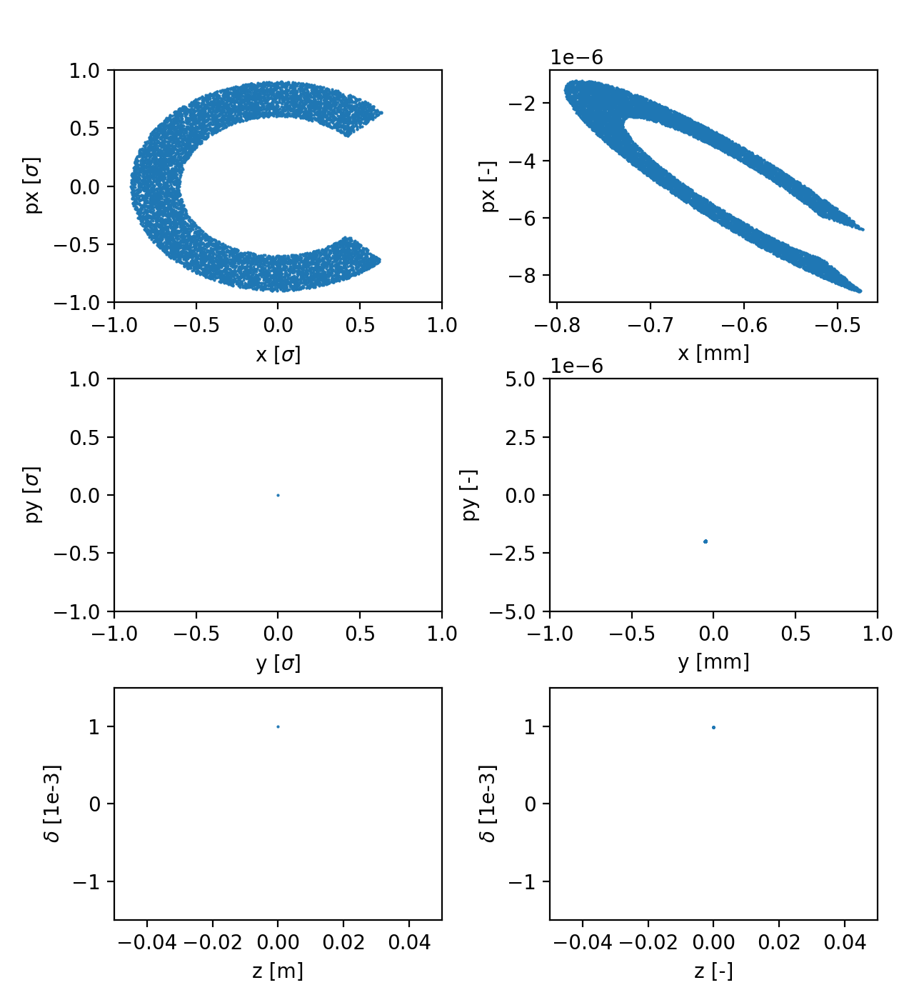
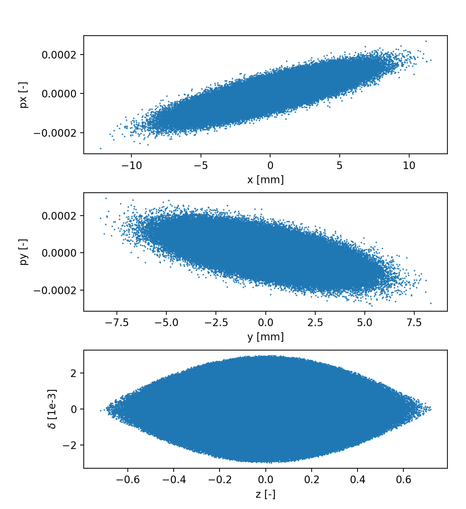

=========
Particles
=========

.. contents:: Table of Contents
    :depth: 3

Introduction
============

In Xsuite, collections of particles for tracking simulations are generated using
the xpart module. Such collections are stored as instances of the
:class:`xpart.Particles` class. All quantities stored by the
Particles objects are described in the
:ref:`Particles class documentation<particlesapi>`.

The following sections illustrate:

 - How to create Particles objects on CPU or GPU, providing the coordinates in
   the form of arrays or using the xpart generators to obtain specific
   distributions (e.g. Gaussian, halo, pencil);
 - How to copy Particles objects (optionally across contexts, e.g GPU to CPU);
 - How to transform Particle objects into dictionaries or pandas dataframes and
   back;
 - How to merge Particles objects;
 - How to filter Particles objects to select a subset of particles satisfying a
   logical condition defined by the user.

Building particles with the Particles class
===========================================

If all the coordinates of the particles are known, a Particles object can be
created directly with the :class:`xpart.Particles` class. For example:

.. literalinclude:: generated_code_snippets/basics_part.py
   :language: python

The ``build_particles`` function
================================

It is often convenient to generate new Particles objects starting from a given
reference particle, which defines the particle type (charge and mass)
and the reference energy and momentum.
This can be accomplished using the :meth:`xpart.build_particles` function or
its alias ``Line.build_particles``, which
feature three different modes illustrated in the following.

The ``set`` mode
----------------

By default, or if ``mode="set"`` is passed to the function, only reference
quantities including `mass0`, `q0`, `p0c`, gamma0, etc. are
taken from the provided reference particle. Particles coordinates, instead, are
set according to the provided input `x`, `px`, `y`, `py`, `zeta`, `delta` (with
zero assumed as default). For example:

.. literalinclude:: generated_code_snippets/build_particles_set.py
   :language: python

Equivalently one can use the ``Line.build_particles`` function (automatically
infers context and reference particle from the line):

.. literalinclude:: generated_code_snippets/build_particles_set_with_tracker.py
   :language: python

The ``shift`` mode
------------------

If ``mode="shift"`` is passed to the function, reference quantities including
quantities including `mass0`, `q0`, `p0c`, gamma0, etc. are taken from the
provided reference particle, and  the other coordinates are set from the
reference particle and shifted according to the provided input `x`, `px`, `y`,
`py`, `zeta`, `delta` (with zero assumed as default). For example:

.. literalinclude:: generated_code_snippets/build_particles_shift.py
   :language: python

Equivalently one can use the `line.build_particles`` function (automatically
infers context and reference particle from the line):

.. literalinclude:: generated_code_snippets/build_particles_shift_with_tracker.py
   :language: python

The ``normalized_transverse`` mode
----------------------------------

If ``mode="normalized_transverse"`` is passed to the function or if any of the
input `x_norm`, `px_norm`, `y_norm`, `py_norm` is provided, the transverse
coordinates are computed from normalized values `x_norm`, `px_norm`, `y_norm`,
`py_norm` (with zero assumed as default) using the
closed-orbit information and the linear transfer map obtained from the `line`
argument or provided by the user. Reference quantities including mass0,
q0, p0c, gamma0, etc. are taken from the provided reference
particle. The longitudinal coordinates are set according to the
provided input `zeta`, `delta` (zero is assumed as default). For example:

.. literalinclude:: generated_code_snippets/build_particles_normalized.py
   :language: python

Generating particles distributions
==================================

For several applications it is convenient to generate the transverse
coordinates in the normalized phase space and then transform them to physical
coordinates. Xpart provides functions to generate independently particles
distributions in the three dimensions, which are then combined using the
:meth:`xpart.build_particles` function. This is illustrated by the following
examples.

Example: Pencil beam
--------------------

The following example shows how to generate a distribution often used for
collimation studies, which combines:

 - A Gaussian distribution in (x, px);
 - A `pencil` distribution in (y, py);
 - A Gaussian distribution matched to the non-linear bucket in (zeta, delta).

.. literalinclude:: generated_code_snippets/pencil.py
   :language: python

.. figure:: figures/pencil.png
    :width: 75%
    :align: center

    Particle distribution in normalized coordinates (left) and physical
    coordinates (right). `See the full code generating the image.
    <https://github.com/xsuite/xpart/blob/main/examples/
    particles_generation/003_pencil.py>`_

Example: Halo beam
--------------------

The following example shows how to generate a distribution, which combines:

 - A `halo` distribution with an azimuthal cut in (x, px);
 - All particles on the closed orbit in (y, py);
 - All particles in the same point in (zeta, delta);

.. literalinclude:: generated_code_snippets/halo.py
   :language: python

    Particle distribution in normalized coordinates (left) and physical
    coordinates (right). `See the full code generating the image.
    <https://github.com/xsuite/xpart/blob/main/examples/
    particles_generation/003_pencil.py>`_

Example: Gaussian bunch
-----------------------

The function :meth:`xpart.generate_matched_gaussian_bunch` can be used to
generate a bunch having Gaussian distribution in all coordinates and matched to
the non-linead RF bucket, as illustrated by the following example:

.. literalinclude:: generated_code_snippets/gaussian.py
   :language: python

    `See the full code generating the image.
    <https://github.com/xsuite/xpart/blob/main/examples/
    particles_generation/004_generate_gaussian.py>`_

Matching distribution at custom location in the ring
----------------------------------------------------

The functions :meth:`xtrack.Line.generate_matched_gaussian_bunch` can be used to
match a particle distribution at a custom location in the ring, as illustrated
by the following example:

.. literalinclude:: generated_code_snippets/match_at_element.py
   :language: python

Copying a Particles object (optionally across contexts)
=======================================================

The ``copy`` method allows making copies of a Particles object within the
same context or in another context. It can be used for example to transfer
Particles objects to/from GPU, as shown by the following example:

.. literalinclude:: generated_code_snippets/copy.py
   :language: python

Saving and loading Particles objects to/from dictionary or file
===============================================================

The methods ``to_dict``/``from_dict`` and ``to_pandas``/``from_pandas`` allow
transforming a Particles object into a dictionary or a pandas dataframe and
back. By default the particles coordinates are transferred to CPU when using
``to_dict`` or ``to_pandas``.

Such methods can be used to save or load particles coordinated to/from file as
shown by the following examples:

Save and load from dictionary
-----------------------------

.. literalinclude:: generated_code_snippets/to_from_dict.py
   :language: python

Save and load from json file
-----------------------------

.. literalinclude:: generated_code_snippets/save_load_json.py
   :language: python

Save and load from pickle file
------------------------------

.. literalinclude:: generated_code_snippets/save_load_pickle.py
   :language: python

Save and load using pandas
--------------------------

.. literalinclude:: generated_code_snippets/save_load_with_pandas.py
   :language: python

Merging and filtering Particles objects
=======================================

Merging Particles objects
-------------------------

The ``merge`` method can be used to merge Particles objects as shown by the
following example:

.. literalinclude:: generated_code_snippets/merge.py
   :language: python

Filtering a Particles object
----------------------------
The ``filter`` method can be used to select a subset of particles satisfying a
logical condition defined by the user.

.. literalinclude:: generated_code_snippets/filter.py
   :language: python

Accessing particles coordinates on GPU contexts
===============================================

When working on a GPU context, the coordinate attributes of particle objects are
not numpy arrays as on the CPU contexts, but specific array types associated
with the specific context (e.g. cupy arrays for contexts of type ContextCupy).
Although such arrays can be directly inspected to a large extent, several
actions, notably plotting with matplotlib and saving to pickle or json files, are
not possible without explicitly transferring the data to the CPU memory.

For this purpose we recommend to use the specific functions provided by the
context in order to keep the code usable on different contexts. For example:

.. code-block:: python

    import xobjects as xo
    import xtrack as xt

    context = xo.ContextCupy()

    particles = xt.Particles(_context=context, x=[1, 2, 3])

    # Avoid the following (which does not work if a CPU context is chosen):
    # x_cpu = particles.x.get()

    # Instead use the following (which is guaranteed to work on all contexts):
    x_cpu = context.nparray_from_context_array(particles.x)

