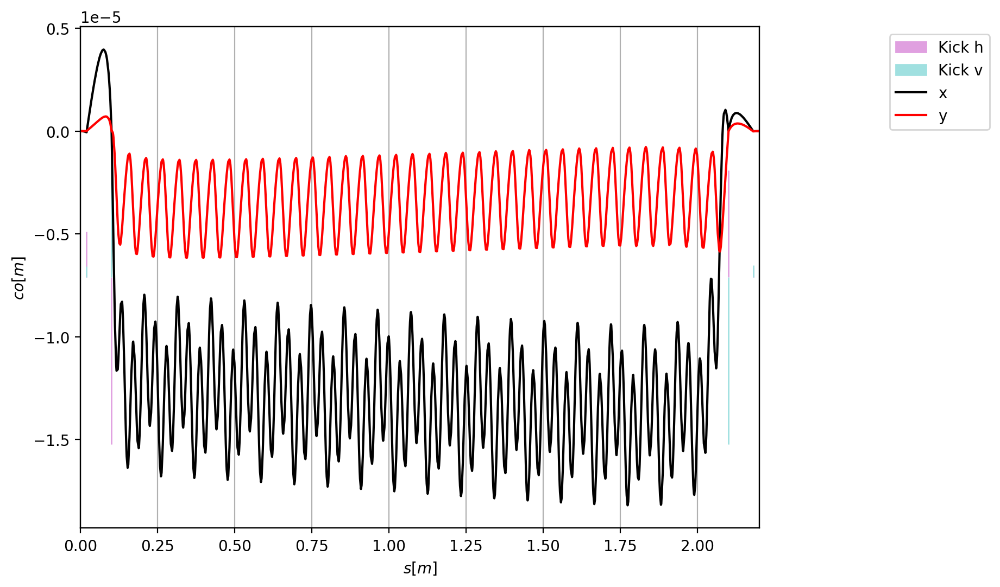
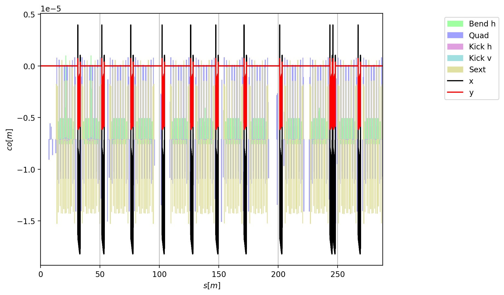

====================================
Modeling s-dependent magnetic fields
====================================

.. contents:: Table of Contents
   :depth: 2

Overview
--------

The :class:`xtrack.SplineBoris` element models a thick magnetic element whose
field varies along the longitudinal coordinate. It is suited to devices such
as undulators, wigglers, fringe field and solenoids, for which a constant multipolar
description is not sufficient.

Internally, particles are tracked using a spatial Boris-like integrator. The
method has second-order convergence in the number of integration steps (the
global discretization error scales as ``n_steps**-2``). Although it is not
strictly symplectic, it preserves phase-space volume and its symplectic deviation
decreases quadratically with the number of integration steps. See the
:doc:`Physics Guide <physicsguide>` for a description of the algorithm and its
main properties.

Within each element, the longitudinal dependence of the field is represented
by fourth-order polynomials and the Lorentz force is integrated with a Boris
stepper. The field data are provided through :class:`xtrack.Spline4` objects.
Each object stores the field value and longitudinal derivative at both ends of
an interval, together with its mean value. The ``bx`` and ``by`` arguments can
also contain tuples of ``Spline4`` objects describing successive transverse
derivatives of the field.

An extended field map is typically represented by a line containing several
``SplineBoris`` elements, with one element for each longitudinal region over
which a polynomial representation is used. The ``n_steps`` parameter controls
the number of Boris integration steps within each element.

Building an undulator from a field map
--------------------------------------

The following example loads a three-dimensional field map of an SLS undulator
and fits the on-axis field and its transverse derivatives in consecutive
longitudinal regions. Each fitted region is converted to a ``SplineBoris``
element. Thin correctors are then inserted near the ends of the resulting line
and matched to close the trajectory through the device.

The ``FieldFitter`` used here is an example-specific helper. Users can apply
their own fitting procedure to produce the corresponding ``Spline4`` data for
each longitudinal region.

.. literalinclude:: generated_code_snippets/splineboris_build_undulator.py
   :language: python

   Horizontal and vertical trajectories through the corrected undulator.

Installing the undulator in a ring
----------------------------------

A line made of ``SplineBoris`` elements can be serialized and imported into
another :class:`xtrack.Environment`. In the following example, the undulator
built above is loaded, installed at several straight sections of the SLS ring,
and included in a four-dimensional Twiss calculation.

.. literalinclude:: generated_code_snippets/splineboris_undulators_in_sls_ring.py
   :language: python

   Horizontal and vertical closed orbit in the SLS ring with the undulators
   installed.
