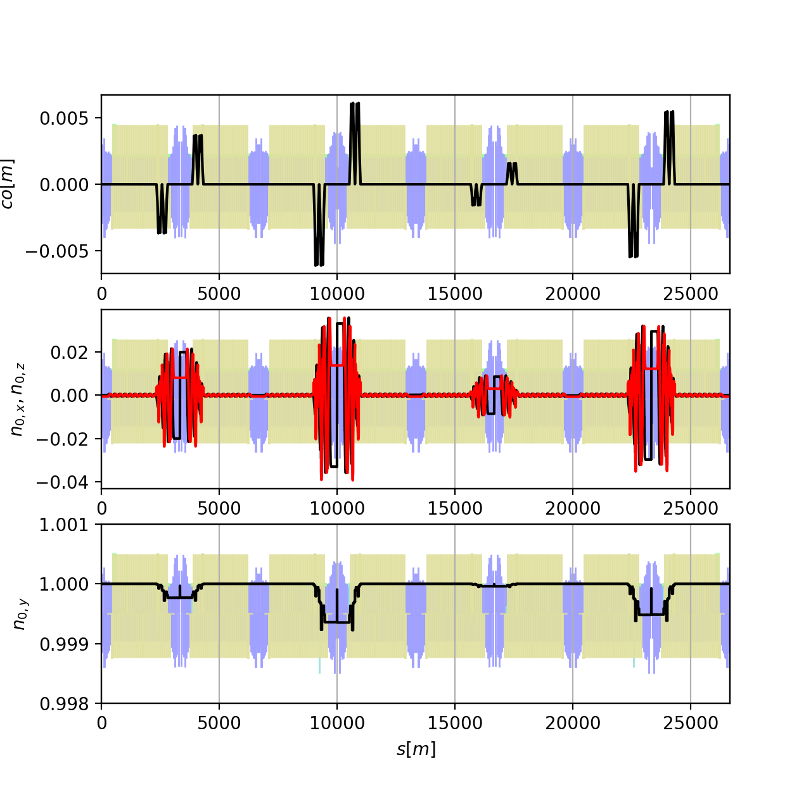
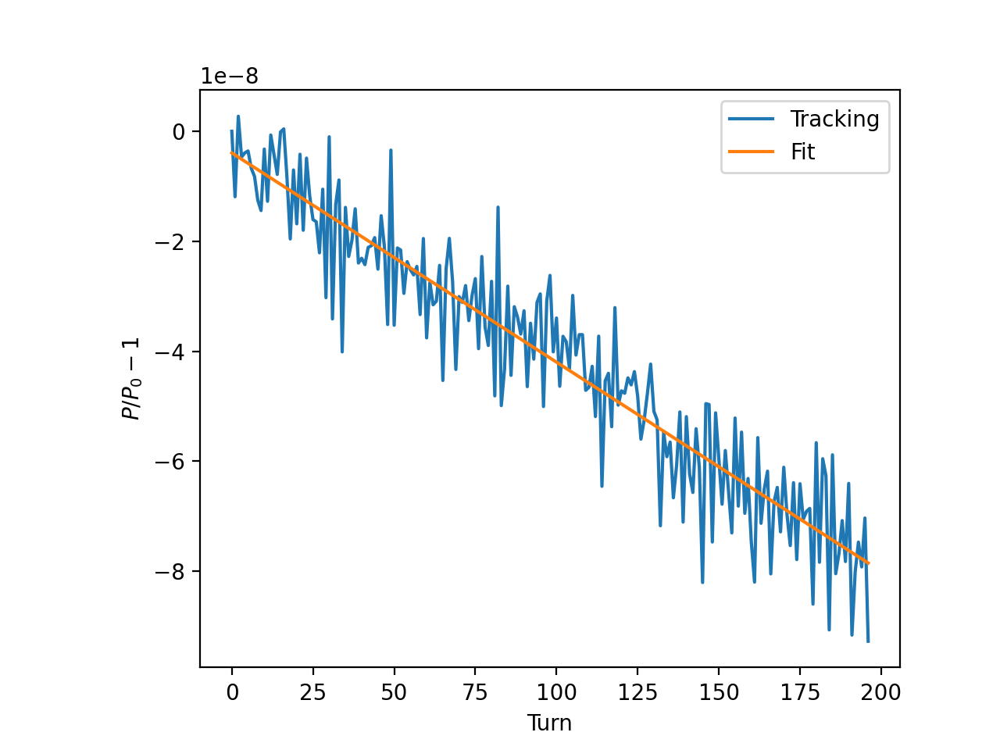

Spin and polarization
=====================

The spin of the particles can be tracked in Xsuite together with the other
6D phase space coordinates. Additionally, the twiss module can provide the spin
closed solution and the equilibrium polarization due to the Sokolov-Ternov effect.

Equilibrium polarization and spin closed solution
-------------------------------------------------

In the following example the twiss module is used to compute the effect of solenoid
and compensation bumps on the spin closed solution and on the equilibrium polarization
in the LEP collider.

.. literalinclude:: generated_code_snippets/n0_and_eq_polarization.py
   :language: python

    The spin closed solution from the example above.

Tracking with spin and Monte Carlo simulation of radiative depolarization
-------------------------------------------------------------------------

The following example shows how, by tracking particles with spin and including
synchrotron radiation and quantum excitation, one can simulate the radiative
depolarization in the LEP collider. This method, which accounting for non-linear effects in the estimation of
the equilibrium polarization, is described in detail in
`Z. Duan et al., A Monte-Carlo simulation of the equilibrium beam polarization in ultra-high energy electron (positron) storage rings <https://www.sciencedirect.com/science/article/pii/S0168900215005744>`_ .

.. literalinclude:: generated_code_snippets/monte_carlo_polarization.py
   :language: python

    The polarization decay from the Monte Carlo simulation (blue dots) and the
    fitted exponential decay (orange line).

