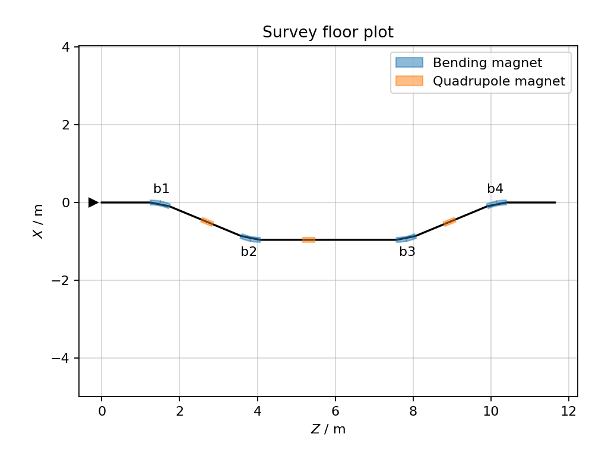

.. _survey-user-guide:

======
Survey
======

Xtrack provides a survey method associated to the line that can be used to
compute the position and orientation of the local reference frame in a global
coordinate system. The returned table contains, among other quantities, the
global coordinates ``X``, ``Y`` and ``Z`` and the orientation angles ``theta``,
``phi`` and ``psi`` at each element.

For a complete description of the available options, please refer to the
:ref:`Survey API reference <survey-api-reference>`.

See also :ref:`SurveyTable class <surveytable-api-reference>` in the Reference
guide for the table type returned by ``line.survey()``.

.. contents:: Table of Contents
    :depth: 3

Basic usage
===========

The following example builds a small line, computes its survey, inspects a few
columns from the resulting table, and makes a floor plot using
``survey.plot``.

.. literalinclude:: generated_code_snippets/survey.py
   :language: python

    Floor plot of the reference trajectory as obtained from Xtrack survey.

Starting from a selected element
================================

By default, ``line.survey()`` starts from the beginning of the line with the
global frame aligned to the local reference frame. A different origin and
orientation can be selected with ``element0`` and the initial coordinates
``X0``, ``Y0``, ``Z0``, ``theta0``, ``phi0`` and ``psi0``.

