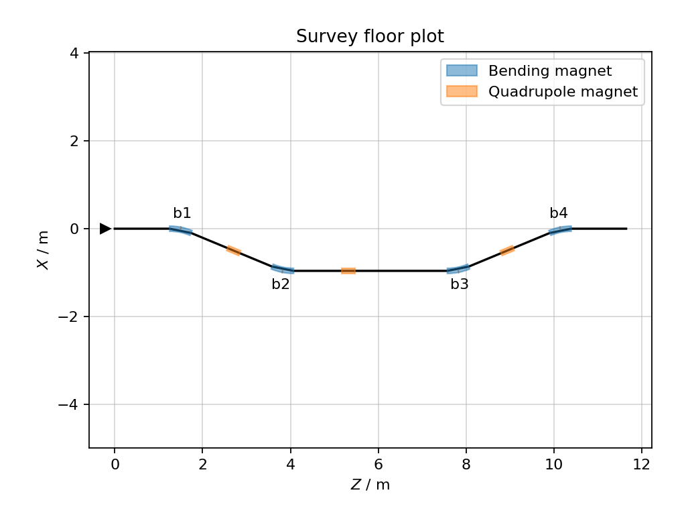
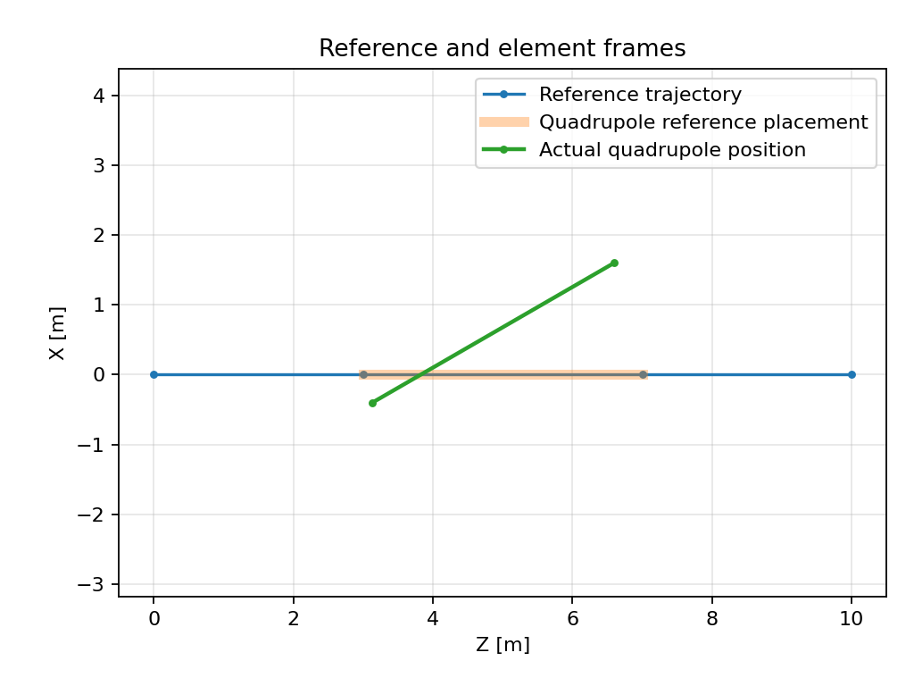

.. _survey-user-guide:

======
Survey
======

Xtrack provides a survey method associated to the line that can be used to
compute the position and orientation of the local reference frame in a global
coordinate system. The returned table contains, among other quantities, the
global coordinates ``X``, ``Y`` and ``Z`` and the orientation angles ``theta``,
``phi`` and ``psi`` at each element.

For a complete description of the available options, please refer to the
:ref:`Survey API reference <survey-api-reference>`.

.. contents:: Table of Contents
    :depth: 3

Basic usage
===========

The following example builds a small line, computes its survey, inspects a few
columns from the resulting table, and makes a floor plot using
``survey.plot``.

.. literalinclude:: generated_code_snippets/survey.py
   :language: python

    Floor plot of the reference trajectory as obtained from Xtrack survey.

Reference and element frames
============================

By default, a survey describes the reference trajectory. With
``include_element_frames=True``, the survey table also contains the frames at
the actual entrance and exit of each element, including the effect of element
misalignments. The four frames associated with an element can be retrieved as
:class:`xtrack.Frame` objects using
:meth:`xtrack.survey.SurveyTable.get_all_frames`.

The following example places a translated and rotated quadrupole on a straight
reference trajectory, extracts its reference and element frames, and compares
their positions.

.. literalinclude:: generated_code_snippets/survey_element_frames.py
   :language: python

    Reference placement and actual position of a misaligned quadrupole.

Starting from a selected element
================================

By default, ``line.survey()`` starts from the beginning of the line with the
global frame aligned to the local reference frame. A different origin and
orientation can be selected with ``element0`` and the initial coordinates
``X0``, ``Y0``, ``Z0``, ``theta0``, ``phi0`` and ``psi0``.
