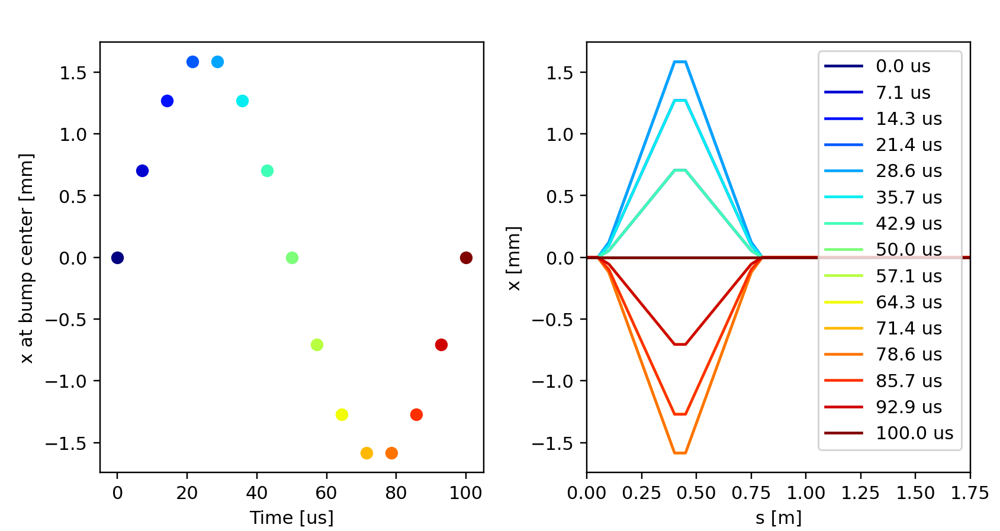
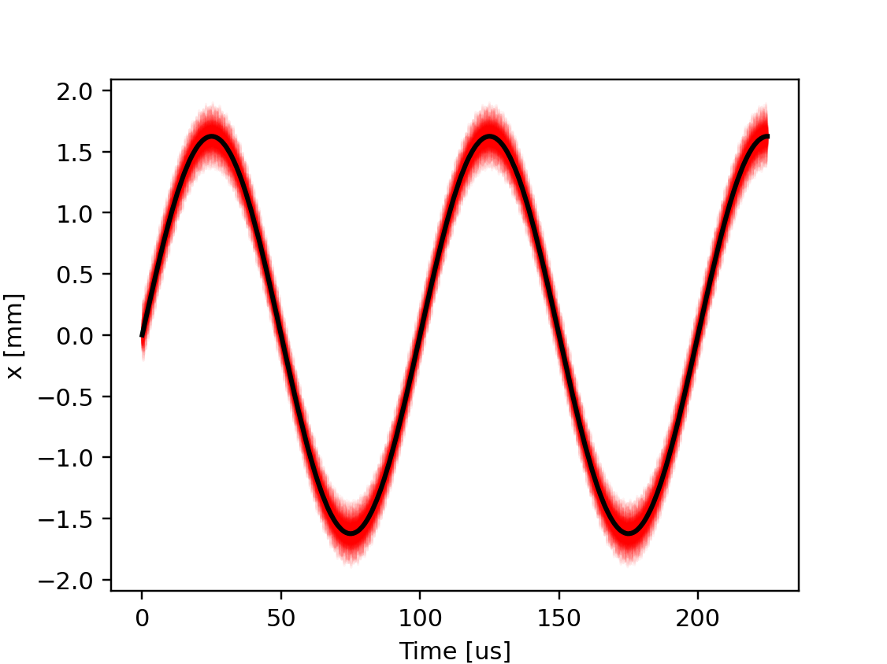
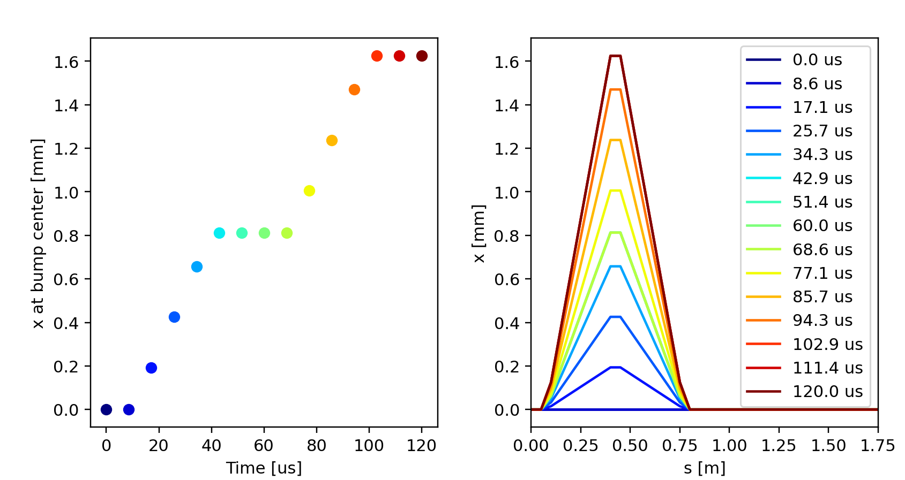
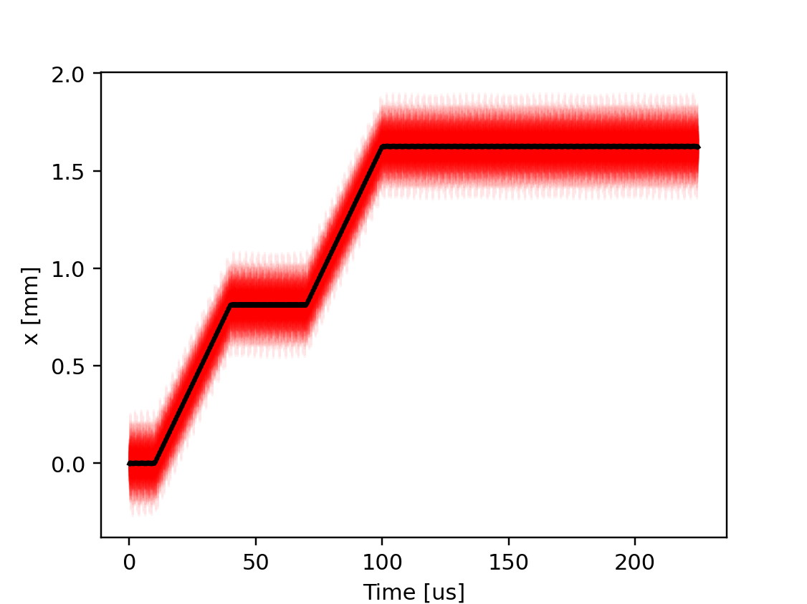
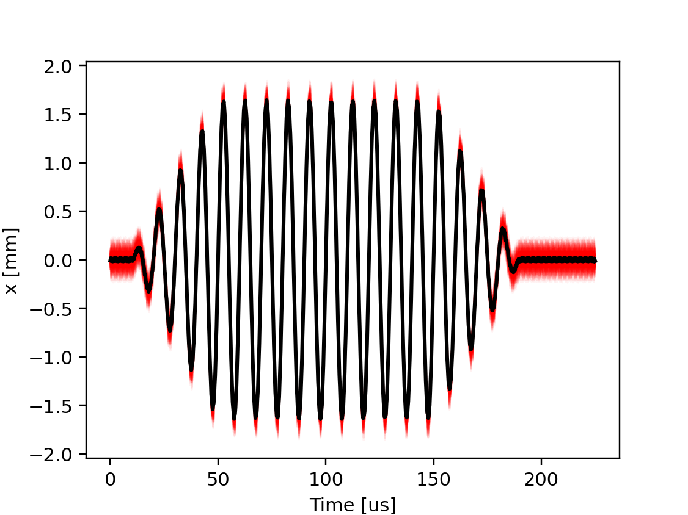

Time dependent knobs
--------------------

To simulate the effect of time-changing properties of the beam-line it is possible
to control any lattice element attribute with a time-dependent function.
For this purpose, the variable ``t_turn_s`` provides the time in seconds since
the start of the simulation and is updated automatically during tracking.
The simulation of an orbit bump driven by a sinusoidal
function is shown in the following example.

.. literalinclude:: generated_code_snippets/dynamic_bump_sin.py
   :language: python

    Orbit bump behavior as obained from the twiss for different settings of
    ``t_turn_s``.

    Beam position at the bump center during the tracking simulation. The red
    lines indicate the position of individual particles, the black line is
    their average position.

.. literalinclude:: generated_code_snippets/dynamic_bump_piece_wise_linear.py
   :language: python

Instead of built-in functions, it is also possible to use piece-wise linear
functions defined by the user. For example, the function in the figure below
can be obtained with the following code:

    Orbit bump behavior as obained from the twiss for different settings of
    ``t_turn_s``.

    Beam position at the bump center during the tracking simulation. The red
    lines indicate the position of individual particles, the black line is
    their average position.

It is also possible to combine piece-wise linear functions with built-in functions
in the same expression. For example, the following code can be used to generate
a modulated sinusoidal function:

.. literalinclude:: generated_code_snippets/dynamic_bump_sin_env.py
   :language: python

    Beam position at the bump center during the tracking simulation. The red
    lines indicate the position of individual particles, the black line is
    their average position.