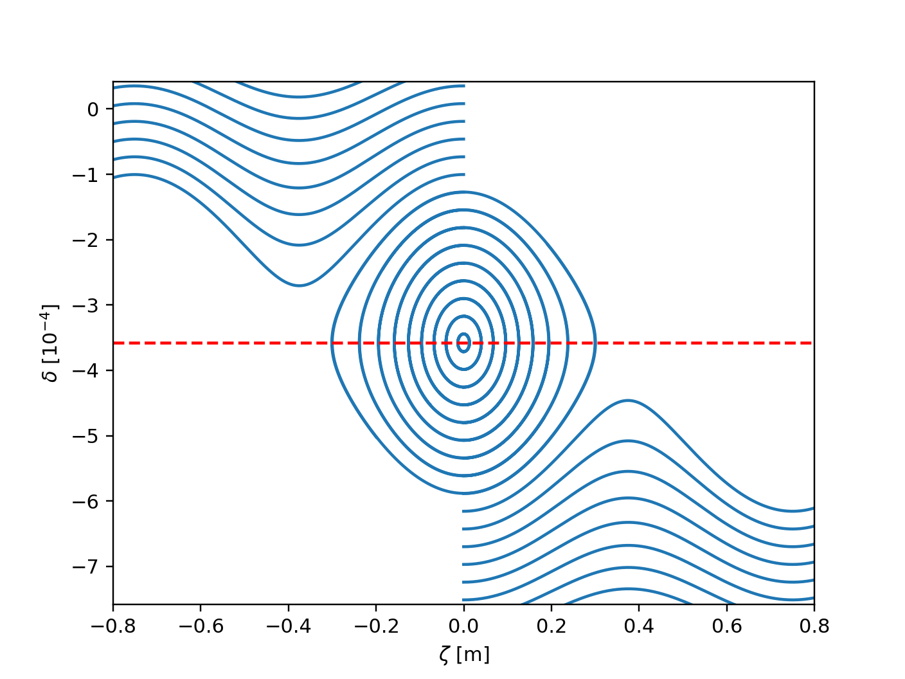

=====
Track
=====

.. contents:: Table of Contents
    :depth: 3

Tracking particles with Xsuite
==============================

The tracking of particles through a beam line can be simulated using the
:meth:`xtrack.Line.track` method of the :class:`xtrack.Line` class. This is
illustrated in the following example:

.. literalinclude:: generated_code_snippets/track.py
    :language: python

.. include:: dynamic_aperture.rst

.. include:: particles_monitor.rst

Start/stop tracking at specific elements
========================================

It is possible to start and/or stop the tracking at specific elements of the
beam line. This is illustrated in the following example:

.. literalinclude:: generated_code_snippets/tracker_start_stop.py
    :language: python

Backtracking
============

It is possible to track particles backwards through a beam line, provided that
all elements included in the line support backtracking. The following example
illustrates how backtrack for a full turn or between specified elements:

.. literalinclude:: generated_code_snippets/backtrack.py
    :language: python

.. include:: freeze_longitudinal.rst

Time-dependent line properties
==============================

Time-dependent elements whose properties change slowly (compared to the revolution period)
such as Bumpers or Tune-Ramps can be modelled using :doc:`time_dependent_knobs`
or :doc:`fast_lattice_changes` (the latter being more performant when a large 
number of elements is affected). For some specific use cases there exist also 
specialized elements, such as the :class:`xtrack.ACDipole`.

If the time-dependent change is in the order of the revolution period or faster,
specialized elements such as an :doc:`exciter` (time-dependent thin multipole)
or :class:`xtrack.RFMultipole` have to be used.

.. include:: time_dependent_knobs.rst

.. include:: fast_lattice_changes.rst

.. include:: exciter.rst

.. include:: acceleration.rst

Off-momentum from RF frequency change
=====================================

The xtrack default RF are synchronized with the reference particle (simply
because of the coordinate choice). For this reason a change of the RF frequency
does not result in a change in the revolution frequency. To obtain a change in
the revolution frequency (and hence in the momentum) it is necessary to
introduce explicitly a time delay, using the element :class:`xtrack.ZetaShift`.
This is illustrated in the following example:

.. literalinclude:: generated_code_snippets/radial_steering.py
    :language: python

    Longitudinal phase space from tracking. The backet is centered around the
    expected momentum.

.. include:: optimize_for_tracking.rst

