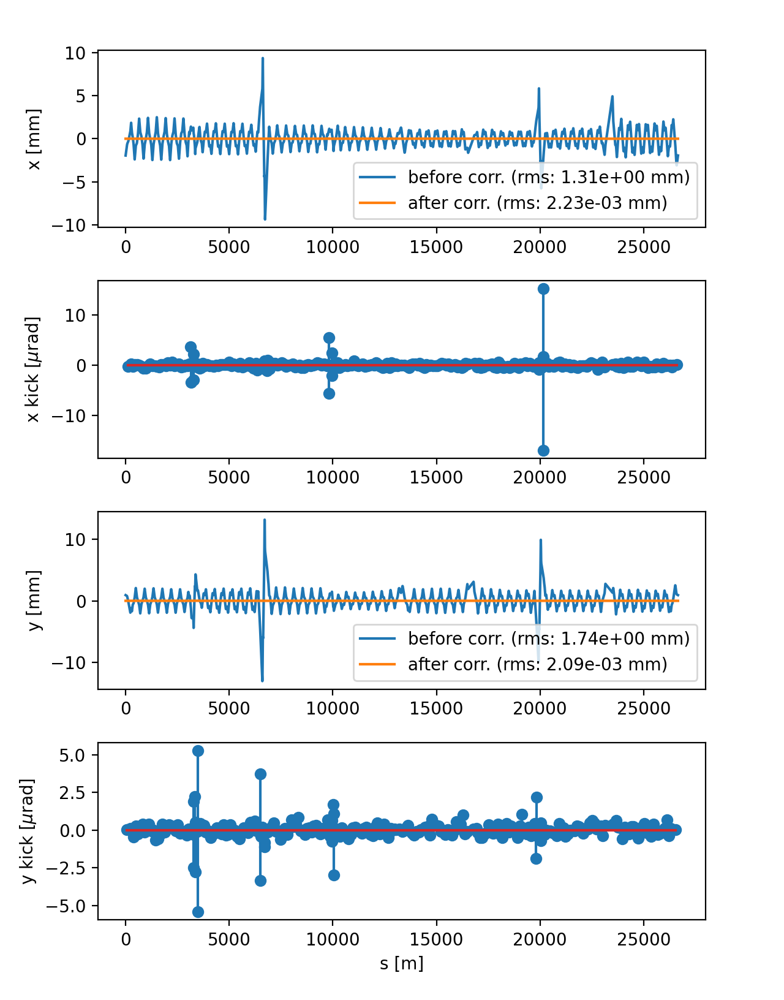
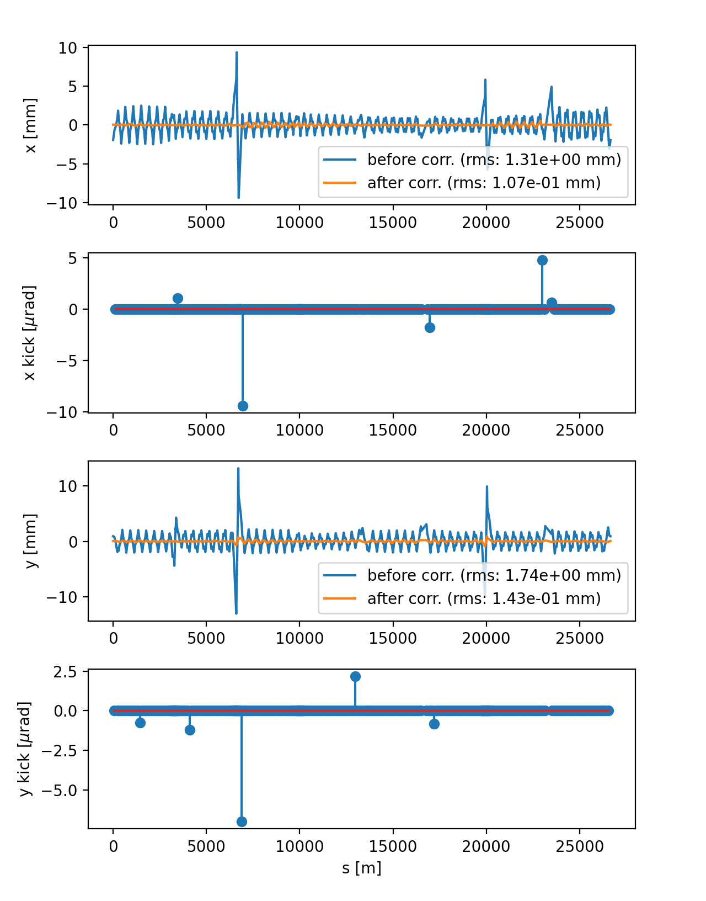
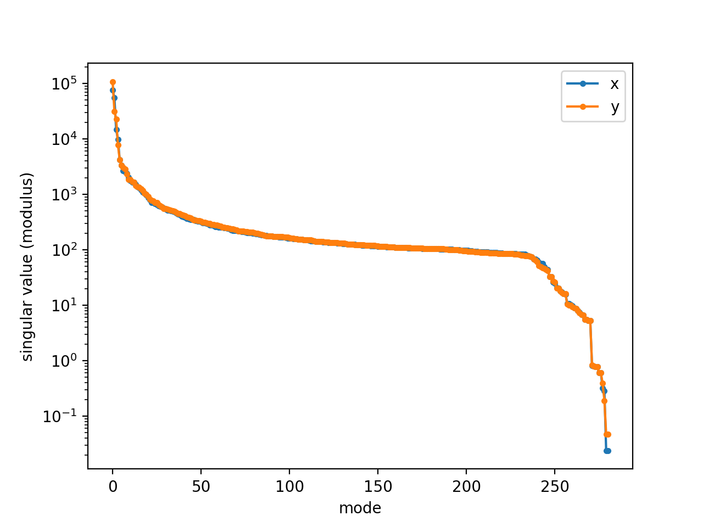
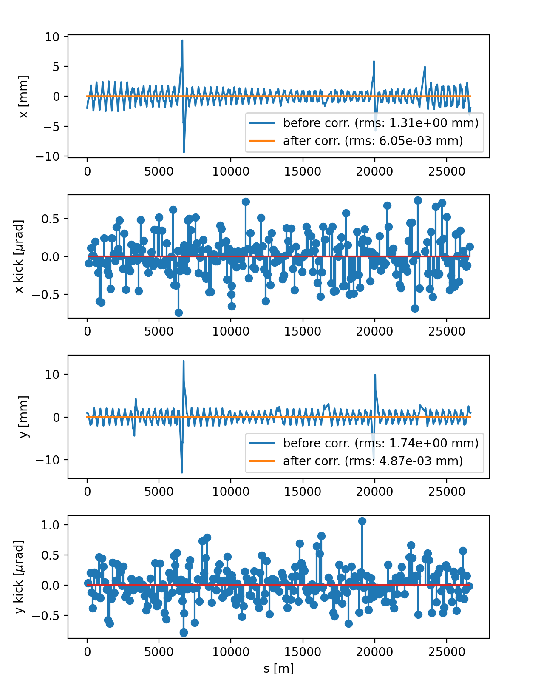
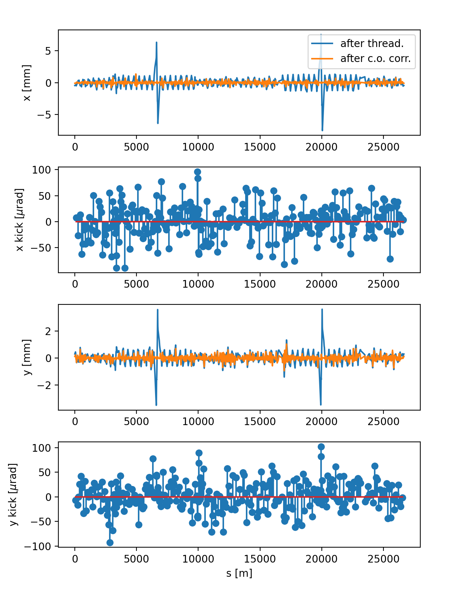
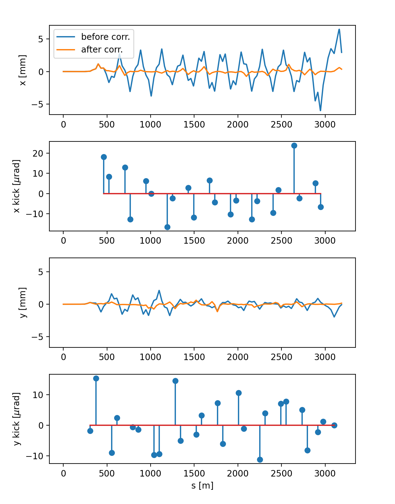

======================================
Closed orbit and trajectory correction
======================================

Xsuite offers the possibility to correct the beam closed orbit for circular
accelerators and the beam trajectory in transfer lines. The correction is
performed using a linearized response matrix, which is built from a twiss table.
The correction is computed using the singular value decomposition (SVD) of the
response matrix (least squares solution) or the
`MICADO <https://cds.cern.ch/record/790199/>`_ algorithm.

In the case of rings, in order to proceed with the correction with the approach described above,
it is in necessary to successfully measure the closed orbit before the correction.
In certain cases, when strong lattice perturbations are present (e.g. field errors
or large element misalignments), the closed orbit search might fail. In such cases,
the user can use a threading capability to perform a first correction of the trajectory,
after which the closed orbit search can be performed.

The following sections illustrate the capabilities of the Xsuite trajectory
correction module.

.. contents:: Table of Contents
    :depth: 3

Basic usage
===========

See also: :meth:`xtrack.Line.correct_trajectory`

The following example shows how to correct the closed orbit of a ring using the
least squares approach.

.. literalinclude:: generated_code_snippets/closed_orbit_correction_basic.py
    :language: python

    Result of the orbit correction (SVD based) for the LHC ring.

MICADO correction
=================

See also: :meth:`xtrack.Line.correct_trajectory`

The following example shows how to correct the closed orbit of a ring using the
MICADO algorithm, to achive the best possible correction while using an assigned
number of correctors.

.. literalinclude:: generated_code_snippets/closed_orbit_correction_micado.py
    :language: python

    Result of the orbit correction (MICADO based) for the LHC ring (5 correctors
    per plane are used).

Customized correction
=====================

See also: :meth:`xtrack.Line.correct_trajectory`

In order to customize the correction, the user can generate a correction object
without actually running the correction. This allows advanced control of the
correction process. In the following example, we illustrate how to undo an existing
correction and apply a new one performed with a selected number of singular values.

.. literalinclude:: generated_code_snippets/closed_orbit_correction_customize.py
   :language: python

    Singular values of the response matrix for the LHC ring.

    Result of the customized orbit correction for the LHC ring.

Threading
=========

See also: :meth:`xtrack.Line.correct_trajectory`

In order to proceed with the correction with the approach described above,
it is in necessary to successfully measure the closed orbit before the correction.
In certain cases, when strong lattice perturbations are present (e.g. field errors
or large element misalignments), the closed orbit search might fail. In such cases,
the user can use a threading capability to perform a first correction of the trajectory,
after which the closed orbit search can be performed. This is illustrated in the
following example.

.. literalinclude:: generated_code_snippets/closed_orbit_correction_thread.py
   :language: python

    Closed orbit obtained after threading, followed by conventional SVD correction.

Trajectory correction for transfer lines
========================================

See also: :meth:`xtrack.Line.correct_trajectory`

The following example shows how to correct the beam trajectory in a transfer line.

.. literalinclude:: generated_code_snippets/transfer_line_correction.py
    :language: python

    Trajectory correction for one of the LHC injection lines (TI2).

