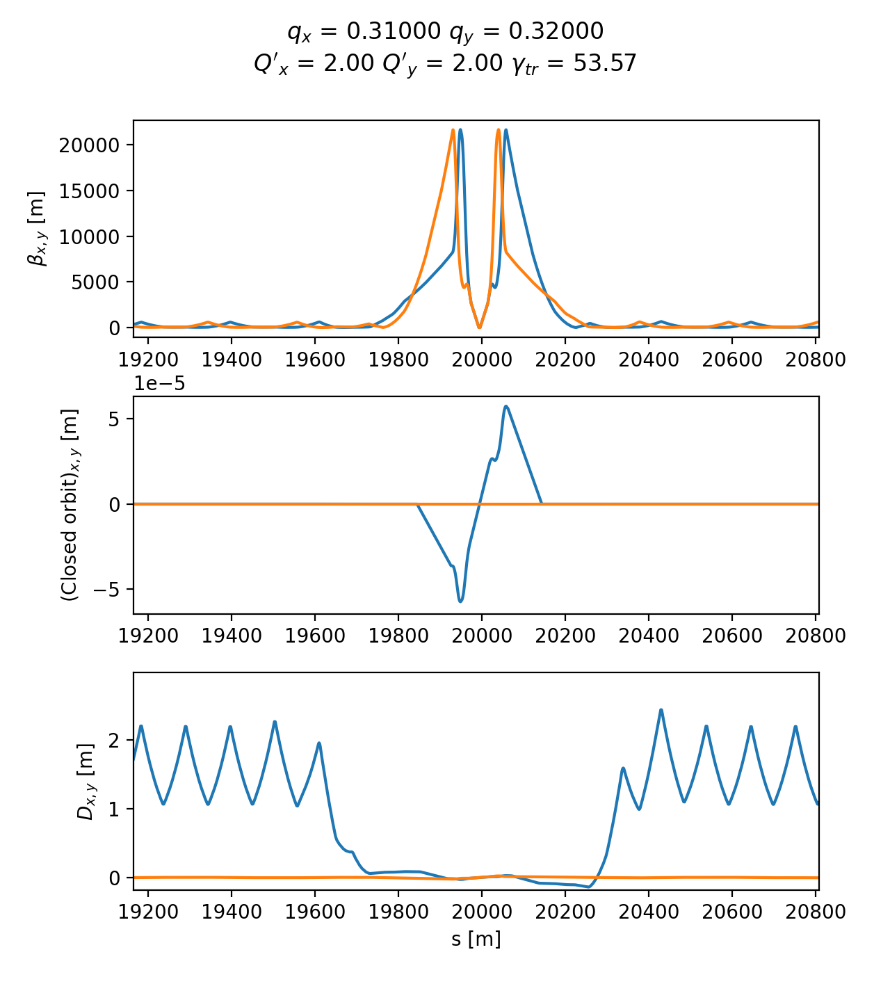
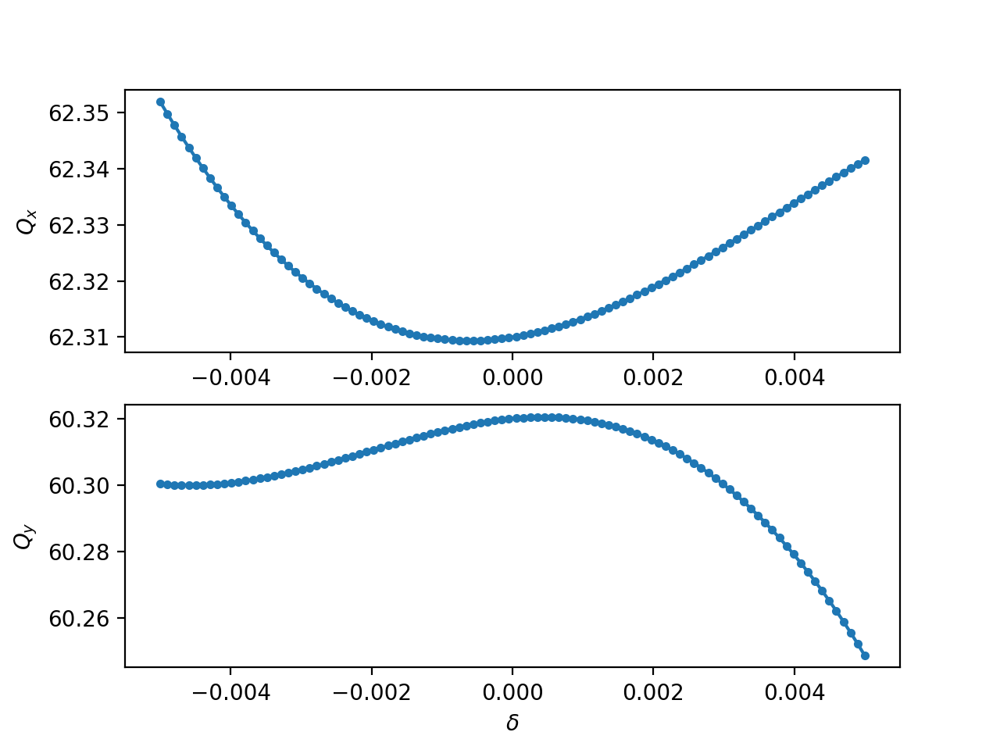
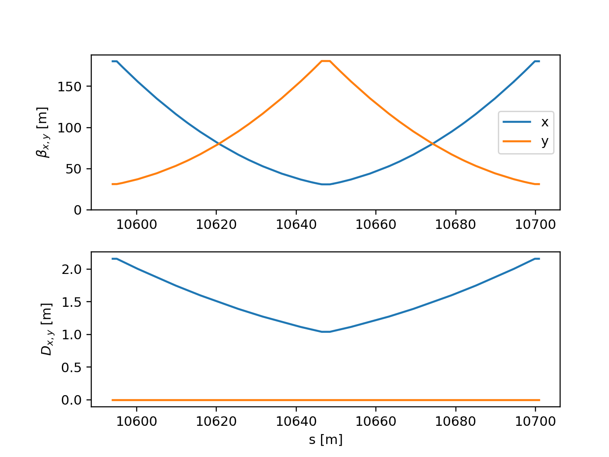
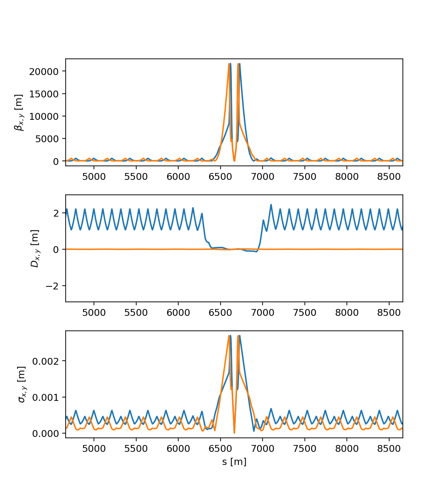
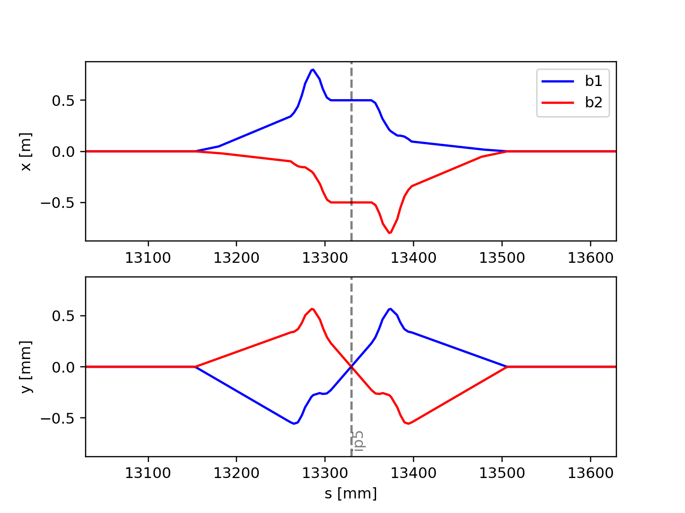

=====
Twiss
=====

Xtrack provides a twiss method associated to the line that can be used to
obtain the lattice functions and other quantities like tunes, chromaticities,
slip factor, etc. This is illustrated in the following examples. For a complete
description of all available options and output quantities, please refer to the
:meth:`xtrack.Line.twiss` method documentation.

.. contents:: Table of Contents
    :depth: 3

Basic usage (ring)
==================

The following example shows how to use the twiss method to obtain the lattice
functions and other quantities for a ring.

.. literalinclude:: generated_code_snippets/twiss.py
   :language: python

    Lattice functions and accelerator parameters as obtained by Xtrack twiss.

Inspecting twiss output
=======================

The twiss table has several access options as illustrated in the following
example.

.. literalinclude:: generated_code_snippets/table_slicing.py
   :language: python

4d method (RF off)
==================

When the RF cavities are disabled or not included in the lattice (or when the
longitudinal motion is artificially frozen) it is not possible to use the
standard method for the twiss calculation.
In these cases, the "4d" method can be used, as illustrated in the following
examples:

.. literalinclude:: generated_code_snippets/method_4d.py
   :language: python

Off-momentum twiss
==================

The 4d mode of the twiss can be used providing in input the initial momentum.
This feature can be used to measure the non-linear momentum detuning of a ring
as shown in the following example:

.. literalinclude:: generated_code_snippets/tune_vs_delta.py
   :language: python

Twiss with "initial" conditions
===============================

The twiss calculation can be performed with initial conditions provided by the
users or extracted from an existing twiss table, as illustrated in the
following example:

.. literalinclude:: generated_code_snippets/twiss_range.py
   :language: python

.. figure:: figures/twiss_range.png
    :width: 80%
    :align: center

    Result of all twiss calculations with initial conditions shown in the
    example above.

Periodic twiss on a portion of a line
=====================================

The twiss method can also be used to find the periodic solution for a portion of
a beam line, as illustrated in the following example:

.. literalinclude:: generated_code_snippets/twiss_range_periodic.py
   :language: python

    Result of the twiss with periodic boundary conditions.

Beam sizes from twiss table
===========================

The transverse and longitudinal beam sizes can be computed from the twiss table,
as illustrated in the following example:

.. literalinclude:: generated_code_snippets/compute_beam_sizes.py
   :language: python

    Beam sizes as obtained from twiss.

Particles normalized coordinates
====================================

The twiss table holds the information to convert particle physical coordinates
into normalized coordinates. This can be done with the method
``get_normalized_coordinates`` as illustrated in the following example:

.. literalinclude:: generated_code_snippets/compute_norm_coordinates.py
   :language: python

Reverse reference frame
=======================

The `reverse`` flag, allows getting the output of the twiss in the counter-rotating
reference system. When `reverse` is True, the ordering of the elements is reversed,
the zero of the `s`` coordinate and of the phase advances is set at the new start,
the sign of the coordinates  `s`` and `x`` is inverted, while the sign of the
coordinate `y` is unchanged. This is illustrated in the following example:

.. literalinclude:: generated_code_snippets/twiss_reverse.py
   :language: python

    Closed Orbit of the two LHC beams in the same reference frame. This is
    obtained setting ``reverse=True`` on the twiss of beam 2.

Twiss defaults
==============

It is possible to change the default behavior of the twiss method for a given
line using ``line.twiss_defaults``, which is a dictionary with the desired
default twiss arguments. This is illustrated in the following example:

.. literalinclude:: generated_code_snippets/twiss_default.py
   :language: python

Twiss with synchrotron radiation
================================

See :doc:`synchrotron_radiation`.